@import "style.less"

# Technical Development Report: Blockchain-Based Event Ticketing Platform

## I. Introduction

The project is a blockchain-based event ticketing platform for Vietnam-oriented ticket commerce. Its purpose is to reduce counterfeit tickets, constrain abusive resale, preserve familiar payment flows in VND, and support real-time event entry through verifiable ticket ownership.

The current implementation has migrated away from the original NFT-ticket and ERC-4337 design. The active localchain architecture uses a ledger smart contract (`TicketLedger`) to represent ticket ownership, an EIP-7702 delegated EOA execution model through `Handler`, and a `TicketPaymaster` that sponsors gas by refilling the delegated EOA after authorized batch execution. Payment confirmation is not performed directly on-chain by payment gateways; instead, the backend verifies signed MoMo/VNPAY-style webhooks and issues EIP-712 payment authorizations consumed by the buyer or reseller through frontend-built transactions.

The system is organized as a monorepo containing smart contracts, backend services, frontend applications, shared SDK packages, database migrations, infrastructure templates, CI/CD workflows, and testing suites. The repository also contains legacy components from the NFT-era architecture, especially `TicketNFT`, legacy `Marketplace`, and `worker-mint`. These are retained in the codebase but are not the current local deployment path.

## II. Planning

### 1. Reason to Select Project

The project addresses a concrete commerce problem: digital ticket distribution must maintain authenticity, limit resale abuse, support high-concurrency sales, and preserve a simple user experience for buyers who may not understand blockchain. The selected architecture tries to combine conventional payment rails, backend service orchestration, and on-chain ownership verification.

From the repository evidence, the project was selected because it has clear end-user value and technical depth:

| Motivation                    | Technical Implication                                                                               | Evidence                                                                   |
| ----------------------------- | --------------------------------------------------------------------------------------------------- | -------------------------------------------------------------------------- |
| Prevent counterfeit tickets   | Ticket ownership and usage state should be verifiable through a ledger or contract sync projection. | `TicketLedger.sol`, `contract-sync-service`                                |
| Preserve familiar payments    | VND payments through MoMo/VNPAY are the MVP payment rail.                                           | `docs/product/REQUIREMENT_DECISIONS.md`, `payment-orchestrator`            |
| Reduce blockchain UX friction | Frontend hides wallet creation and builds EIP-7702 transactions.                                    | `apps/web/src/features/onboarding/*`, `apps/web/src/lib/localchain.ts`     |
| Limit resale abuse            | Marketplace markup cap and KYC gate.                                                                | `MarketplaceV2.sol`, `marketplace-service`                                 |
| Support event operations      | QR verification, check-in metrics, refund, recovery, disputes.                                      | `checkin-service`, `refund-service`, `recovery-service`, `dispute-service` |

### 2. Initial System Request

The initial request, reconstructed from `REQUIREMENTS.md`, `ANALYSIS.md`, and `DESIGN.md`, was to build a blockchain-enabled ticketing system with:

| Requirement Area        | Original Intent                                                | Current Status                                                                                              |
| ----------------------- | -------------------------------------------------------------- | ----------------------------------------------------------------------------------------------------------- |
| Authentication          | Phone OTP and session management.                              | Implemented in `auth-service`; web onboarding consumes it.                                                  |
| Wallet                  | Embedded wallet abstraction with gas sponsorship.              | Migrated to local EOA plus EIP-7702 authorization and paymaster refill.                                     |
| Primary purchase        | Reserve ticket, pay through VND gateway, mint or issue ticket. | Implemented through reservation/payment services and current ledger authorization flow.                     |
| Ticket ownership        | On-chain proof of ownership.                                   | Current source is `TicketLedger` and contract-sync projection.                                              |
| Marketplace             | KYC-gated resale with markup cap.                              | Implemented in transitional service and `MarketplaceV2`; off-chain fee settlement remains partly simulated. |
| Check-in                | QR verification and duplicate prevention.                      | Implemented as HMAC skeleton and integration tests; chain mark-as-used is tested with harness.              |
| Refund                  | Event cancellation and refund handling.                        | Implemented as service skeleton plus `TicketLedger.cancelTicket` harness.                                   |
| Recovery                | Lost-device and guardian recovery.                             | Service skeleton and `GuardianAccount` exist, but end-to-end integration remains unclear.                   |
| Disputes                | Support escalation and audit trail.                            | Service skeleton supports cases, messages, escalation, moderation.                                          |
| Native mobile packaging | Mobile-ready buyer experience.                                 | `apps/web` can be wrapped through Capacitor 8 for Android and iOS.                                          |

### 3. Feasibility Analysis

| Dimension                    | Assessment                                                                             | Justification                                                                                                                                   |
| ---------------------------- | -------------------------------------------------------------------------------------- | ----------------------------------------------------------------------------------------------------------------------------------------------- |
| Technical feasibility        | Feasible as a local/sandbox architecture; production readiness requires consolidation. | Contracts, services, SDK, frontend, and integration tests demonstrate main flows, but several services use in-memory state or runtime schemas.  |
| Economic feasibility         | Feasible for MVP because VND-only reduces settlement and compliance complexity.        | `REQUIREMENT_DECISIONS.md` disables USDT for MVP and payment service restricts currency to VND.                                                 |
| Operational feasibility      | Partially feasible; runbooks and CI/CD exist, but implementation maturity varies.      | `docs/ops/*`, `.github/workflows/*`, `scripts/*`; many service endpoints are skeletons.                                                         |
| Legal/compliance feasibility | Requires continued validation.                                                         | VN compliance docs exist, but private-key recovery, KYC provider handling, data retention, and blockchain framing need maintainer confirmation. |
| Schedule feasibility         | Feasible for demo/MVP pilot, not yet confirmed for production.                         | Flow tests cover critical journeys, but open schema and mock/simulation gaps remain.                                                            |

## III. Analysis

### 1. General Use Case Diagram

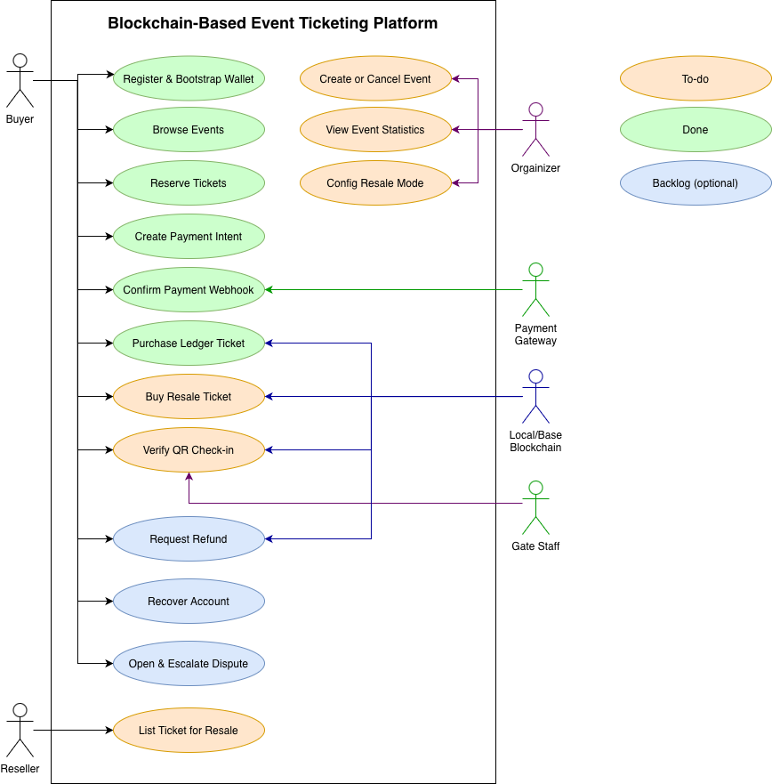

<h3 id="use-case-descriptions">2. Use Case Descriptions</h3>

| Use Case                      | Actor            | Trigger                                          | Precondition                                                                            | Postcondition                                                                                 | Error Situations                                                                                                 | Standard Process                                                                                                                                                                 | Alternative Process                                                                      |
| ----------------------------- | ---------------- | ------------------------------------------------ | --------------------------------------------------------------------------------------- | --------------------------------------------------------------------------------------------- | ---------------------------------------------------------------------------------------------------------------- | -------------------------------------------------------------------------------------------------------------------------------------------------------------------------------- | ---------------------------------------------------------------------------------------- |
| Register and Bootstrap Wallet | Buyer            | User enters phone and OTP.                       | Auth service is available; phone format is valid.                                       | Session tokens and local wallet are stored; wallet is registered and prefunded.               | Rate limit, expired OTP, invalid OTP, prefund delay, wallet mismatch.                                            | Request OTP, verify OTP, create local EOA, register wallet with payment service, poll prefund.                                                                                   | If prefund is delayed, retry through onboarding controller.                              |
| Browse Events                 | Buyer            | User opens home/discover.                        | Event service is available or fallback data exists.                                     | User sees active event list and event details.                                                | Event service unavailable.                                                                                       | Web app calls SDK `listEvents`, fetches details, maps to poster cards.                                                                                                           | Fallback poster data is shown with warning.                                              |
| Reserve Tickets               | Buyer            | User selects event, tier, quantity.              | Inventory exists and quantity is 1..4.                                                  | Reservation is pending with TTL and locked inventory.                                         | Sold out, invalid quantity, duplicate idempotency key, expired reservation.                                      | Ticketing service locks inventory in transaction and returns reservation.                                                                                                        | Existing idempotent result is returned for duplicate key.                                |
| Primary Purchase              | Buyer            | User starts purchase flow.                       | Wallet exists, payment amount and ticket parameters are valid.                          | `TicketLedger` mints ledger tickets to buyer after EIP-712 payment authorization is consumed. | Payment hash unavailable, invalid backend signature, reused payment hash, transaction revert, contract-sync lag. | Register wallet, create payment intent, confirm signed webhook, fetch payment hash, build EIP-7702 transaction, sign authorization, broadcast to localchain, poll contract-sync. | If contract-sync lags but on-chain owner has changed, frontend marks result as degraded. |
| List Ticket for Resale        | Reseller         | Seller submits listing.                          | Seller is authenticated, KYC approved, ticket is transferable, ask price is within cap. | Listing is active in service and/or on-chain marketplace.                                     | KYC required, invalid price, markup exceeded, ticket already listed, ticket not escrowed.                        | Seller transfers ticket to marketplace, lists with price, backend stores listing.                                                                                                | Legacy service can create off-chain listing without on-chain escrow in sandbox.          |
| Buy Resale Ticket             | Buyer            | Buyer selects active marketplace listing.        | Listing is active, buyer is not seller, payment/signing configured.                     | Ticket transfers to buyer and listing becomes completed.                                      | Self-purchase, invalid listing ID, buy hash expired, invalid signature, sync failure.                            | Backend issues buy hash, frontend builds `MarketplaceV2.buyWithSignature`, buyer signs EIP-7702 authorization, broadcast/finalize, contract-sync updates owner.                  | Current web resale broadcast endpoint simulates tx and posts synthetic sync events.      |
| Verify Check-in QR            | Gate Staff       | Staff scans QR.                                  | QR payload has token, event, timestamp, nonce, wallet, signature.                       | First valid scan is accepted, stats updated, mark-as-used job queued.                         | Expired QR, invalid signature, replayed nonce, already used ticket.                                              | Verify HMAC, reject replay, write first-scan record, enqueue mark-as-used.                                                                                                       | Background retry may requeue or fail mark-as-used job.                                   |
| Request Refund                | Buyer            | Event cancelled or postponed with refund window. | User owns ticket/payment context; event is refundable.                                  | Refund request is queued and eventually completed or failed.                                  | Event not refundable, window closed, duplicate refund, invalid price.                                            | Validate policy, create idempotent refund, process payout sync.                                                                                                                  | Resale premium is excluded from refund amount.                                           |
| Recover Account               | Buyer            | User reports lost device.                        | User has account and new device fingerprint.                                            | Recovery enters hold after required channels, then guardian rotation can complete.            | Active recovery already exists, missing verification, hold not finished.                                         | Initiate recovery, verify required channels, wait hold duration, rotate guardian.                                                                                                | User may cancel before completion.                                                       |
| Open and Escalate Dispute     | Buyer or Support | User files support case.                         | Authenticated user; category, title, description, amount supplied.                      | Dispute is open, auto-resolved, escalated, resolved, or closed.                               | Missing fields, unauthorized access, max tier reached, unsupported moderation action.                            | Create case, append message, compute SLA, escalate if needed.                                                                                                                    | Auto rules can resolve duplicate payment or refund SLA cases.                            |
| Create or Cancel Event        | Organizer        | Organizer submits or cancels event.              | `x-organizer-id` present; required event fields valid.                                  | Event is active, updated, or cancelled.                                                       | Missing organizer, invalid fields, forbidden owner mismatch.                                                     | Event service creates event and ticket types or cancels owner event.                                                                                                             | Manual organizer onboarding remains outside public self-service.                         |

### 3. Activity Diagrams

#### 3.1 Primary Purchase Activity

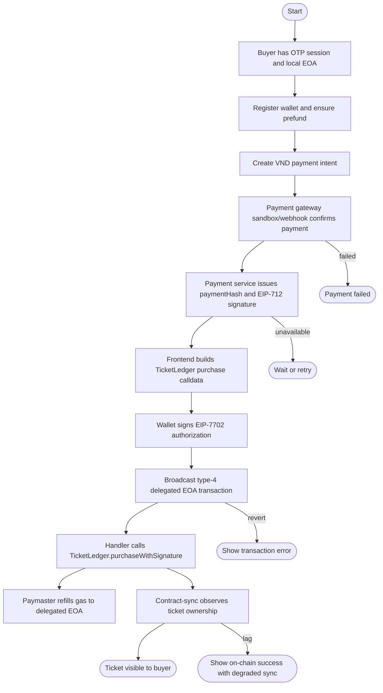
```mermaid
flowchart TD
    Start([Start]) --> Auth[Buyer has OTP session and local EOA]
    Auth --> Register[Register wallet and ensure prefund]
    Register --> Intent[Create VND payment intent]
    Intent --> Pay[Payment gateway sandbox/webhook confirms payment]
    Pay --> Hash[Payment service issues paymentHash and EIP-712 signature]
    Hash --> Build[Frontend builds TicketLedger purchase calldata]
    Build --> Sign[Wallet signs EIP-7702 authorization]
    Sign --> Broadcast[Broadcast type-4 delegated EOA transaction]
    Broadcast --> Ledger[Handler calls TicketLedger.purchaseWithSignature]
    Ledger --> Refill[Paymaster refills gas to delegated EOA]
    Ledger --> Sync[Contract-sync observes ticket ownership]
    Sync --> Done([Ticket visible to buyer])
    Pay -->|failed| PaymentFail([Payment failed])
    Hash -->|unavailable| HashFail([Wait or retry])
    Broadcast -->|revert| TxFail([Show transaction error])
    Sync -->|lag| Degraded([Show on-chain success with degraded sync])
```

#### 3.2 Resale Purchase Activity

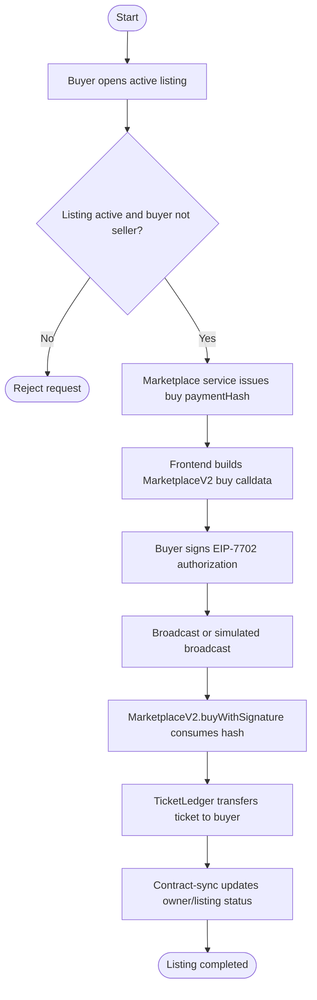
```mermaid
flowchart TD
    Start([Start]) --> Listing[Buyer opens active listing]
    Listing --> Validate{Listing active and buyer not seller?}
    Validate -->|No| Reject([Reject request])
    Validate -->|Yes| BuyHash[Marketplace service issues buy paymentHash]
    BuyHash --> Build[Frontend builds MarketplaceV2 buy calldata]
    Build --> Sign[Buyer signs EIP-7702 authorization]
    Sign --> Broadcast[Broadcast or simulated broadcast]
    Broadcast --> Market[MarketplaceV2.buyWithSignature consumes hash]
    Market --> Transfer[TicketLedger transfers ticket to buyer]
    Transfer --> Sync[Contract-sync updates owner/listing status]
    Sync --> Done([Listing completed])
```

#### 3.3 Check-in Activity

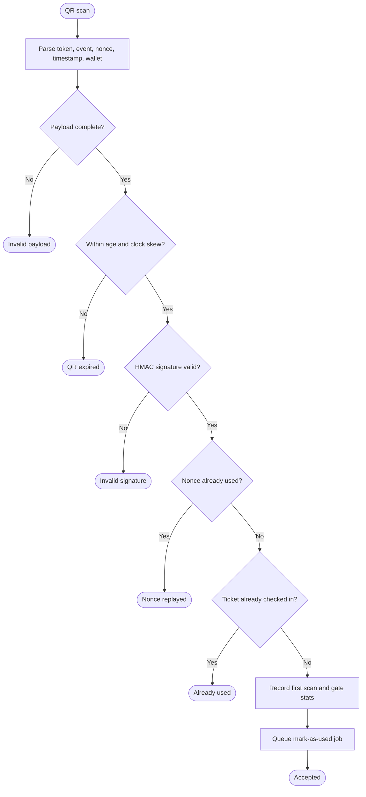
```mermaid
flowchart TD
    Start([QR scan]) --> Parse[Parse token, event, nonce, timestamp, wallet]
    Parse --> Complete{Payload complete?}
    Complete -->|No| InvalidPayload([Invalid payload])
    Complete -->|Yes| Time{Within age and clock skew?}
    Time -->|No| Expired([QR expired])
    Time -->|Yes| Sig{HMAC signature valid?}
    Sig -->|No| BadSig([Invalid signature])
    Sig -->|Yes| Nonce{Nonce already used?}
    Nonce -->|Yes| Replay([Nonce replayed])
    Nonce -->|No| Ticket{Ticket already checked in?}
    Ticket -->|Yes| Used([Already used])
    Ticket -->|No| Accept[Record first scan and gate stats]
    Accept --> Queue[Queue mark-as-used job]
    Queue --> Done([Accepted])
```

#### 3.4 Refund Activity

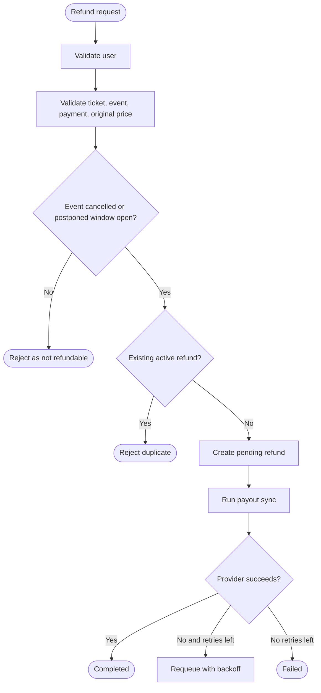
```mermaid
flowchart TD
    Start([Refund request]) --> Auth[Validate user]
    Auth --> Payload[Validate ticket, event, payment, original price]
    Payload --> Policy{Event cancelled or postponed window open?}
    Policy -->|No| Reject([Reject as not refundable])
    Policy -->|Yes| Duplicate{Existing active refund?}
    Duplicate -->|Yes| Conflict([Reject duplicate])
    Duplicate -->|No| Create[Create pending refund]
    Create --> Sync[Run payout sync]
    Sync --> Outcome{Provider succeeds?}
    Outcome -->|Yes| Complete([Completed])
    Outcome -->|No and retries left| Retry[Requeue with backoff]
    Outcome -->|No retries left| Failed([Failed])
```

### 4. Sequence Diagrams

#### 4.1 Primary Purchase Sequence

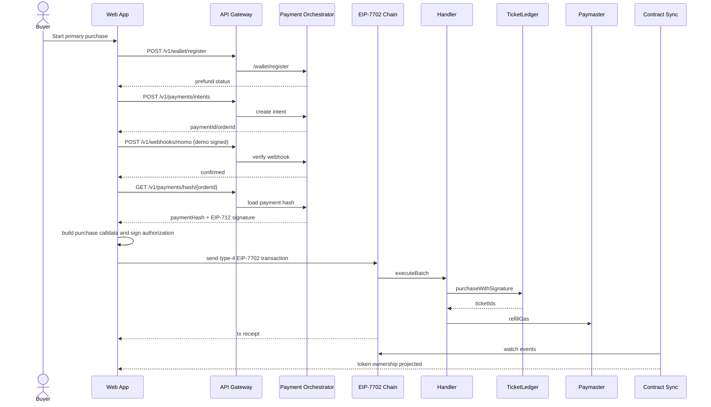
```mermaid
sequenceDiagram
    actor Buyer
    participant Web as Web App
    participant Gateway as API Gateway
    participant Payment as Payment Orchestrator
    participant Chain as EIP-7702 Chain
    participant Handler
    participant Ledger as TicketLedger
    participant Paymaster
    participant Sync as Contract Sync

    Buyer->>Web: Start primary purchase
    Web->>Gateway: POST /v1/wallet/register
    Gateway->>Payment: /wallet/register
    Payment-->>Web: prefund status
    Web->>Gateway: POST /v1/payments/intents
    Gateway->>Payment: create intent
    Payment-->>Web: paymentId/orderId
    Web->>Gateway: POST /v1/webhooks/momo (demo signed)
    Gateway->>Payment: verify webhook
    Payment-->>Web: confirmed
    Web->>Gateway: GET /v1/payments/hash/{orderId}
    Gateway->>Payment: load payment hash
    Payment-->>Web: paymentHash + EIP-712 signature
    Web->>Web: build purchase calldata and sign authorization
    Web->>Chain: send type-4 EIP-7702 transaction
    Chain->>Handler: executeBatch
    Handler->>Ledger: purchaseWithSignature
    Ledger-->>Handler: ticketIds
    Handler->>Paymaster: refillGas
    Chain-->>Web: tx receipt
    Sync->>Chain: watch events
    Sync-->>Web: token ownership projected
```

#### 4.2 Marketplace Resale Sequence

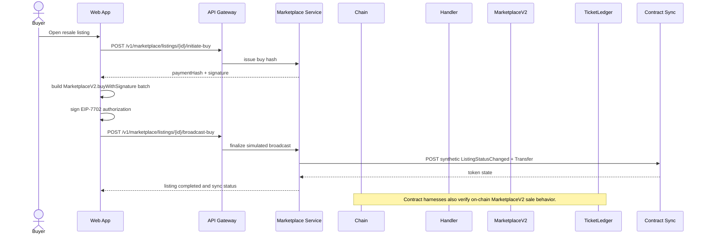
```mermaid
sequenceDiagram
    actor Buyer
    participant Web as Web App
    participant Gateway as API Gateway
    participant MarketSvc as Marketplace Service
    participant Chain as Chain
    participant Handler
    participant Market as MarketplaceV2
    participant Ledger as TicketLedger
    participant Sync as Contract Sync

    Buyer->>Web: Open resale listing
    Web->>Gateway: POST /v1/marketplace/listings/{id}/initiate-buy
    Gateway->>MarketSvc: issue buy hash
    MarketSvc-->>Web: paymentHash + signature
    Web->>Web: build MarketplaceV2.buyWithSignature batch
    Web->>Web: sign EIP-7702 authorization
    Web->>Gateway: POST /v1/marketplace/listings/{id}/broadcast-buy
    Gateway->>MarketSvc: finalize simulated broadcast
    MarketSvc->>Sync: POST synthetic ListingStatusChanged + Transfer
    Sync-->>MarketSvc: token state
    MarketSvc-->>Web: listing completed and sync status
    Note over Chain,Ledger: Contract harnesses also verify on-chain MarketplaceV2 sale behavior.
```

#### 4.3 Check-in Sequence

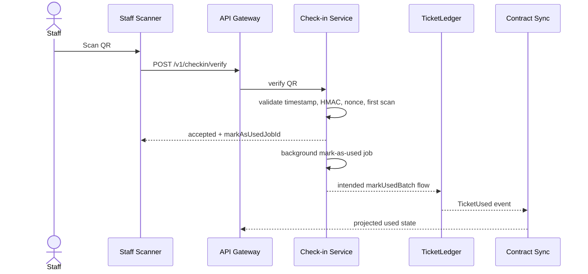
```mermaid
sequenceDiagram
    actor Staff
    participant Scanner as Staff Scanner
    participant Gateway as API Gateway
    participant Checkin as Check-in Service
    participant Ledger as TicketLedger
    participant Sync as Contract Sync

    Staff->>Scanner: Scan QR
    Scanner->>Gateway: POST /v1/checkin/verify
    Gateway->>Checkin: verify QR
    Checkin->>Checkin: validate timestamp, HMAC, nonce, first scan
    Checkin-->>Scanner: accepted + markAsUsedJobId
    Checkin->>Checkin: background mark-as-used job
    Checkin-->>Ledger: intended markUsedBatch flow
    Ledger-->>Sync: TicketUsed event
    Sync-->>Gateway: projected used state
```

### 5. Boundary-Controller-Entity Classes

| Layer      | Classes or Modules                                                                                                                                 | Responsibility                                                                                                                                       |
| ---------- | -------------------------------------------------------------------------------------------------------------------------------------------------- | ---------------------------------------------------------------------------------------------------------------------------------------------------- |
| Boundary   | `apps/web` pages and components                                                                                                                    | Buyer-facing UI for onboarding, discover, tickets, profile, primary purchase, marketplace, resale.                                                   |
| Boundary   | `apps/web/android`, `apps/web/ios`                                                                                                                 | Capacitor native shells that package the web attendee app for Android and iOS.                                                                       |
| Boundary   | `apps/staff-scanner/src/index.ts`                                                                                                                  | Staff scan input and gate metrics facade.                                                                                                            |
| Boundary   | `apps/organizer-portal/src/index.ts`                                                                                                               | Organizer event CRUD and analytics facade.                                                                                                           |
| Boundary   | `services/api-gateway/src/server.ts`                                                                                                               | HTTP API boundary and service routing.                                                                                                               |
| Controller | `auth-service`                                                                                                                                     | OTP lifecycle, sessions, refresh tokens.                                                                                                             |
| Controller | `payment-orchestrator`                                                                                                                             | Payment intents, signed webhooks, wallet prefund, payment hash issuance.                                                                             |
| Controller | `ticketing-service`                                                                                                                                | Reservation, inventory lock, legacy/mock ticket issuance and QR generation.                                                                          |
| Controller | `marketplace-service`                                                                                                                              | Listing lifecycle, resale hash issuance, settlement ledger, simulated broadcast.                                                                     |
| Controller | `contract-sync-service`                                                                                                                            | Contract event ingestion, projection, and query.                                                                                                     |
| Controller | `checkin-service`, `refund-service`, `recovery-service`, `dispute-service`, `notification-service`, `kyc-service`, `event-service`, `user-service` | Domain workflows.                                                                                                                                    |
| Entity     | `TicketLedger`                                                                                                                                     | Ledger ticket ownership, transfer, used state, cancellation.                                                                                         |
| Entity     | `MarketplaceV2`                                                                                                                                    | Resale listing and purchase.                                                                                                                         |
| Entity     | `Handler`, `TicketPaymaster`                                                                                                                       | Delegated EOA execution and gas refill.                                                                                                              |
| Entity     | Database tables                                                                                                                                    | Users, devices, KYC, events, ticket types, reservations, tickets, listings, payments, payment hashes, wallet prefunds, check-ins, refunds, disputes. |

### 6. Class Diagram

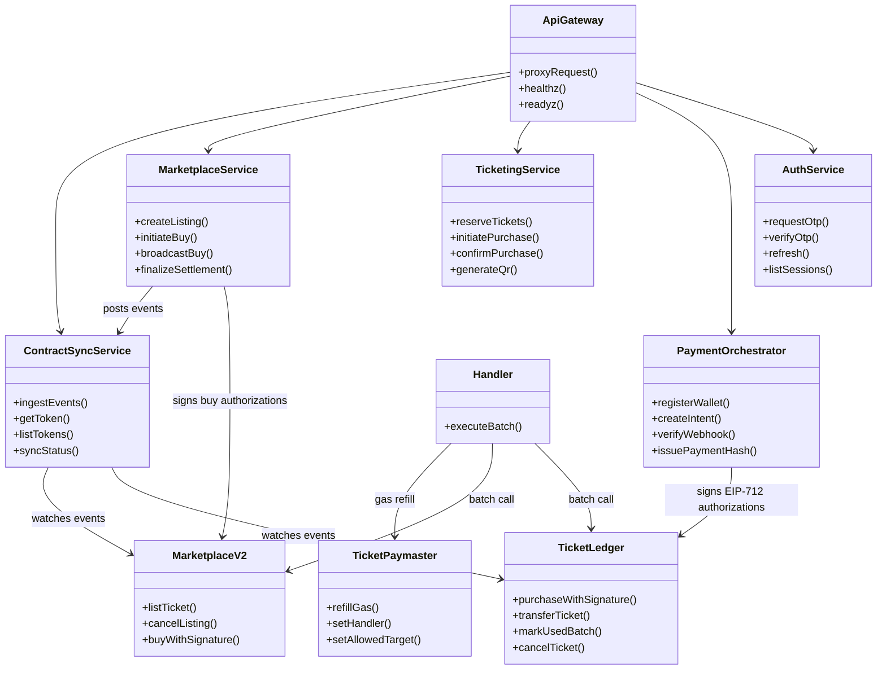
```mermaid
classDiagram
    class ApiGateway {
      +proxyRequest()
      +healthz()
      +readyz()
    }
    class AuthService {
      +requestOtp()
      +verifyOtp()
      +refresh()
      +listSessions()
    }
    class PaymentOrchestrator {
      +registerWallet()
      +createIntent()
      +verifyWebhook()
      +issuePaymentHash()
    }
    class TicketingService {
      +reserveTickets()
      +initiatePurchase()
      +confirmPurchase()
      +generateQr()
    }
    class MarketplaceService {
      +createListing()
      +initiateBuy()
      +broadcastBuy()
      +finalizeSettlement()
    }
    class ContractSyncService {
      +ingestEvents()
      +getToken()
      +listTokens()
      +syncStatus()
    }
    class TicketLedger {
      +purchaseWithSignature()
      +transferTicket()
      +markUsedBatch()
      +cancelTicket()
    }
    class MarketplaceV2 {
      +listTicket()
      +cancelListing()
      +buyWithSignature()
    }
    class Handler {
      +executeBatch()
    }
    class TicketPaymaster {
      +refillGas()
      +setHandler()
      +setAllowedTarget()
    }

    ApiGateway --> AuthService
    ApiGateway --> PaymentOrchestrator
    ApiGateway --> TicketingService
    ApiGateway --> MarketplaceService
    ApiGateway --> ContractSyncService
    PaymentOrchestrator --> TicketLedger : signs EIP-712 authorizations
    MarketplaceService --> MarketplaceV2 : signs buy authorizations
    MarketplaceService --> ContractSyncService : posts events
    Handler --> TicketLedger : batch call
    Handler --> MarketplaceV2 : batch call
    Handler --> TicketPaymaster : gas refill
    ContractSyncService --> TicketLedger : watches events
    ContractSyncService --> MarketplaceV2 : watches events
```

## IV. Design

### 1. Interface Design and Major Screens

| Interface        | Main Purpose                                                                                       | Implementation Evidence                                                | Current Maturity                                                                                      |
| ---------------- | -------------------------------------------------------------------------------------------------- | ---------------------------------------------------------------------- | ----------------------------------------------------------------------------------------------------- |
| Home / Discover  | Poster-first event discovery, category filter, preview modal.                                      | 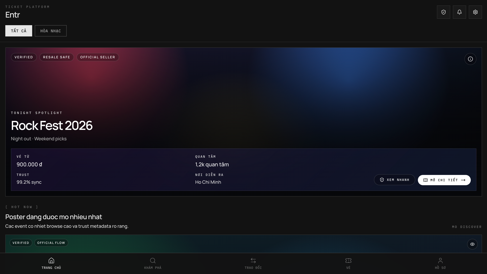 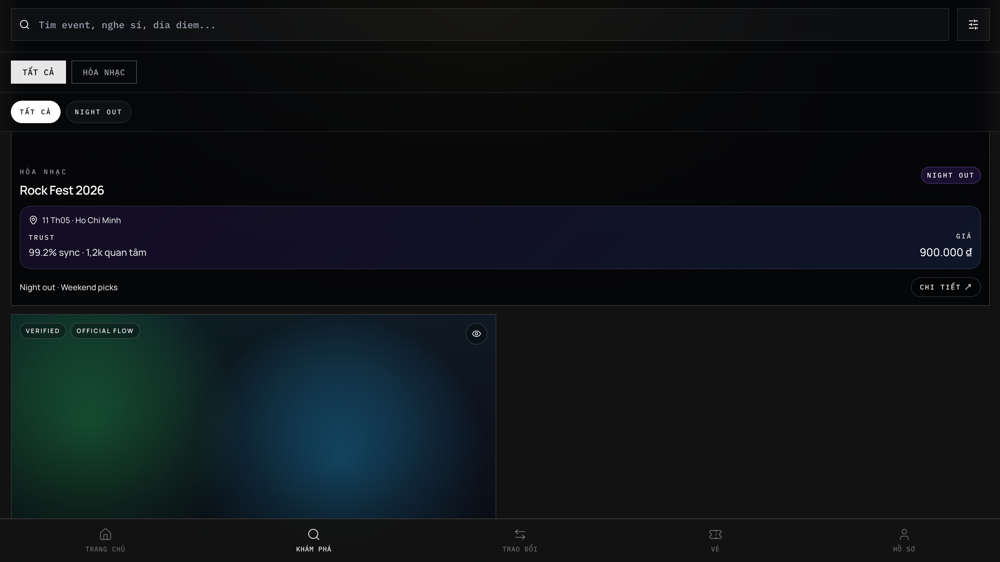             | Implemented with API and fallback data.                                                               |
| Onboarding       | Phone OTP, OTP verify, local wallet creation, wallet registration, prefund polling.                | 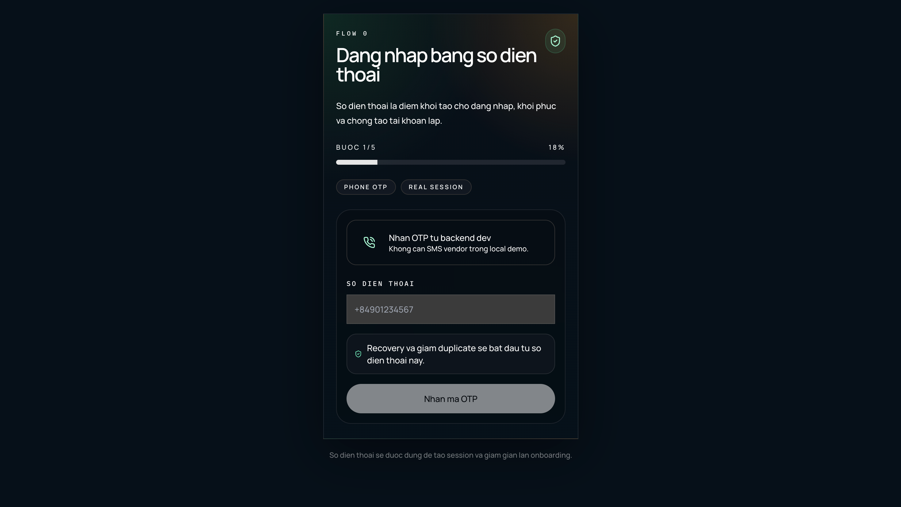                                   | Implemented for web/localchain flow.                                                                  |
| Event Detail     | Event metadata and ticket tier navigation.                                                         | 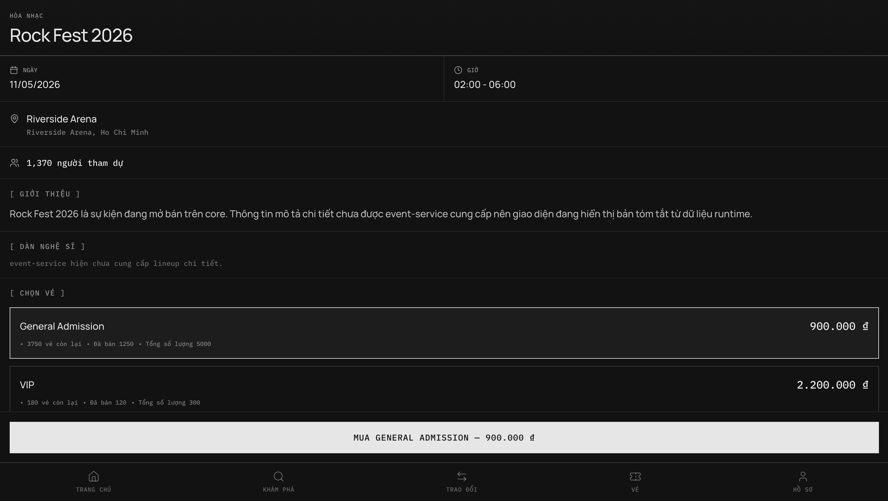                                 | Implemented with fallback support.                                                                    |
| Primary Purchase | Payment intent, webhook demo, payment hash, tx draft, signing, localchain broadcast, sync polling. | 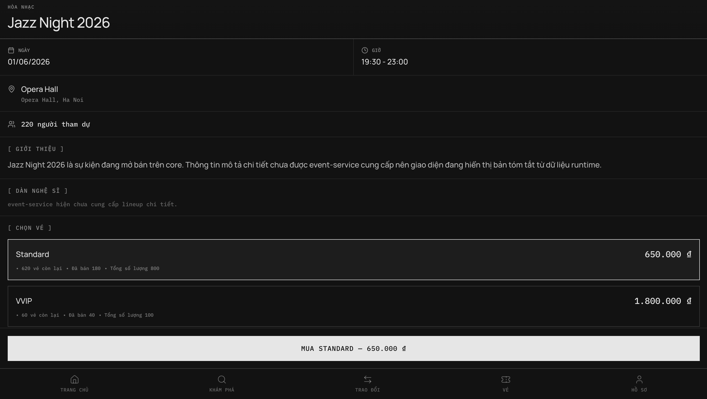                         | Implemented as explicit demo/developer flow.                                                          |
| Tickets          | Upcoming/past tickets and ticket cards.                                                            | 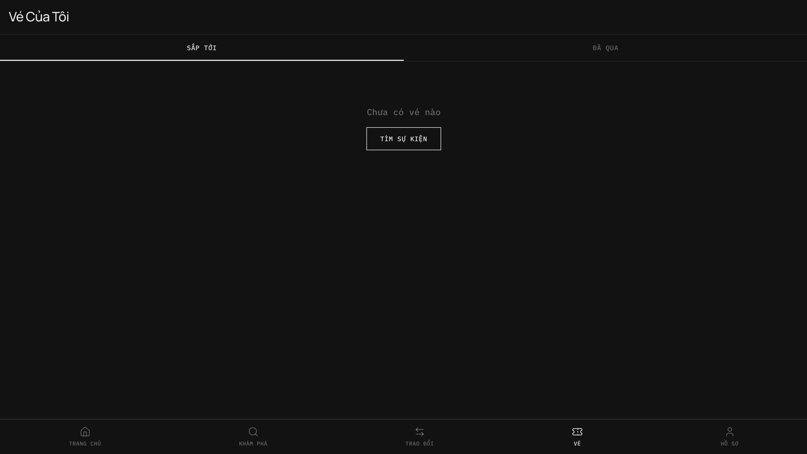                                         | Implemented with API/fallback data.                                                                   |
| Marketplace      | Listing browsing and market overview.                                                              | 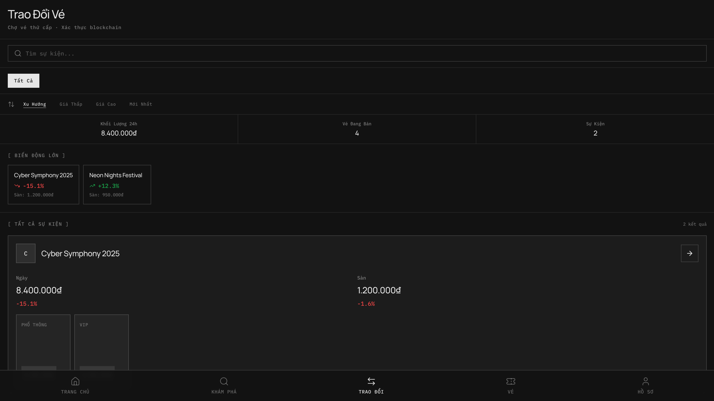                                 | Implemented with active listings and fallback.                                                        |
| Resale Purchase  | Buy hash preparation, transaction draft, signing, broadcast/finalize.                              | `apps/web/src/pages/ResalePurchasePage.tsx`                            | Implemented as transitional simulated broadcast flow.                                                 |
| Resale Sale      | Ticket selection and price entry.                                                                  | `apps/web/src/pages/ResaleSalePage.tsx`                                | UI skeleton with static local tickets; not wired end-to-end.                                          |
| Profile          | User profile and summary stats.                                                                    | 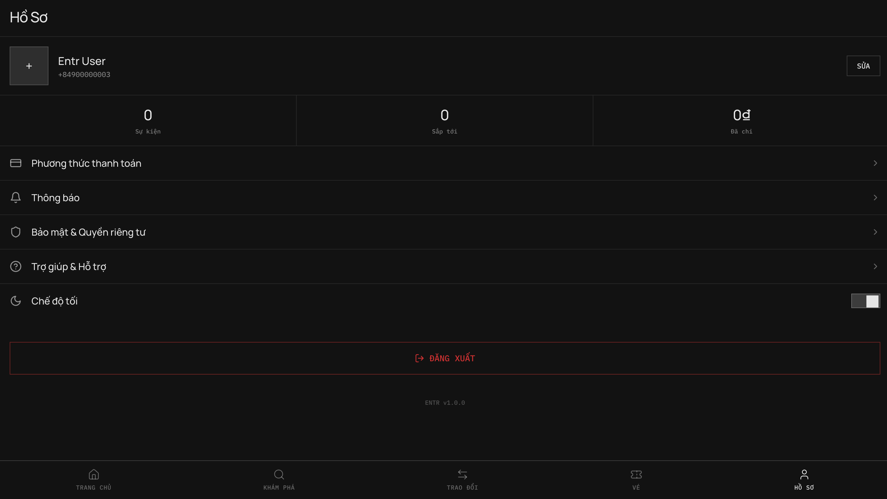                                         | Implemented with API/fallback data.                                                                   |
| Staff Scanner    | QR scan and gate metrics.                                                                          | `apps/staff-scanner/src/*`, `checkin-service`                          | Logic skeleton plus service integration tests.                                                        |
| Organizer Portal | Event CRUD and analytics.                                                                          | `apps/organizer-portal/src/*`, `event-service`                         | Logic skeleton; event service has actual organizer endpoints.                                         |
| Native App Shell | Android/iOS wrapper for the attendee web app.                                                      | `apps/web/capacitor.config.ts`, `apps/web/android/*`, `apps/web/ios/*` | Generated Capacitor shell with app ID `com.entr.ticketplatform`; production native hardening remains. |

### 2. Package Dependency Diagram

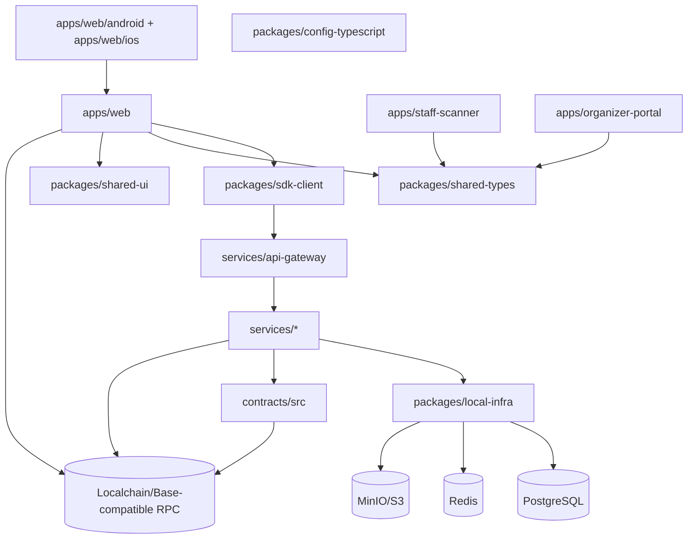
```mermaid
flowchart TD
    Web[apps/web]
    NativeShell[apps/web/android + apps/web/ios]
    Staff[apps/staff-scanner]
    Organizer[apps/organizer-portal]
    SDK[packages/sdk-client]
    Types[packages/shared-types]
    UI[packages/shared-ui]
    Config[packages/config-typescript]
    Gateway[services/api-gateway]
    Services[services/*]
    Infra[packages/local-infra]
    DB[(PostgreSQL)]
    Redis[(Redis)]
    MinIO[(MinIO/S3)]
    Contracts[contracts/src]
    Chain[(Localchain/Base-compatible RPC)]

    Web --> SDK
    Web --> Types
    Web --> UI
    NativeShell --> Web
    Staff --> Types
    Organizer --> Types
    SDK --> Gateway
    Gateway --> Services
    Services --> Infra
    Infra --> DB
    Infra --> Redis
    Infra --> MinIO
    Services --> Contracts
    Web --> Chain
    Services --> Chain
    Contracts --> Chain
```

### 3. Database Design

The migration baseline is normalized around users, events, ticketing, marketplace, payments, refunds, check-in, disputes, wallet prefunds, and payment hashes. However, several services create additional runtime tables independently. This is a design gap: a production system should converge on one migration-owned schema.

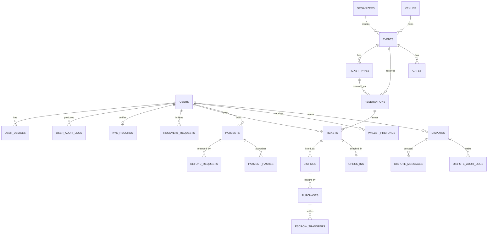
```mermaid
erDiagram
    USERS ||--o{ USER_DEVICES : has
    USERS ||--o{ USER_AUDIT_LOGS : produces
    USERS ||--o| KYC_RECORDS : verifies
    USERS ||--o{ RECOVERY_REQUESTS : initiates
    ORGANIZERS ||--o{ EVENTS : creates
    VENUES ||--o{ EVENTS : hosts
    EVENTS ||--o{ TICKET_TYPES : has
    EVENTS ||--o{ RESERVATIONS : receives
    TICKET_TYPES ||--o{ RESERVATIONS : reserved_as
    RESERVATIONS ||--o{ TICKETS : issues
    USERS ||--o{ TICKETS : owns
    TICKETS ||--o{ LISTINGS : listed_as
    LISTINGS ||--o{ PURCHASES : bought_by
    PURCHASES ||--o{ ESCROW_TRANSFERS : settles
    USERS ||--o{ PAYMENTS : pays
    PAYMENTS ||--o{ REFUND_REQUESTS : refunded_by
    PAYMENTS ||--o{ PAYMENT_HASHES : authorizes
    USERS ||--o{ WALLET_PREFUNDS : receives
    EVENTS ||--o{ GATES : has
    TICKETS ||--o| CHECK_INS : checked_in
    USERS ||--o{ DISPUTES : opens
    DISPUTES ||--o{ DISPUTE_MESSAGES : contains
    DISPUTES ||--o{ DISPUTE_AUDIT_LOGS : audits
```

### 4. Smart Contract Design

| Contract          | Responsibility                                                                            | Current Role                                                             |
| ----------------- | ----------------------------------------------------------------------------------------- | ------------------------------------------------------------------------ |
| `TicketLedger`    | Ledger ticket issuance, transfer, check-in state, cancellation, replay-safe payment hash. | Canonical current ticket contract.                                       |
| `MarketplaceV2`   | Resale listing, buy authorization, ticket transfer, pending seller payout.                | Canonical current marketplace contract.                                  |
| `Handler`         | EIP-7702 delegated batch executor with target allowlist check through paymaster.          | Canonical transaction execution layer.                                   |
| `TicketPaymaster` | Gas sponsorship treasury with authorized handlers and targets.                            | Canonical gas refill layer.                                              |
| `GuardianAccount` | Delayed guardian recovery account.                                                        | Implemented but not fully integrated into current frontend/backend flow. |
| `TicketNFT`       | ERC-721 ticket implementation.                                                            | Legacy/currently not deployed in local platform.                         |
| `Marketplace`     | ERC-721 custody resale marketplace.                                                       | Legacy/currently superseded by `MarketplaceV2`.                          |

## V. Implementation

### 1. Technology Stack Summary

| Layer             | Technology                                                                                                                       |
| ----------------- | -------------------------------------------------------------------------------------------------------------------------------- |
| Frontend          | React 18, Vite, TypeScript, React Router, TanStack Query, Tailwind CSS, Radix-style components, lucide-react, viem, Capacitor 8. |
| Backend           | Node.js, TypeScript, native HTTP servers, PostgreSQL, Redis, MinIO/S3.                                                           |
| Smart Contracts   | Solidity 0.8.x, Foundry, OpenZeppelin AccessControl/Pausable/ReentrancyGuard patterns.                                           |
| Blockchain Client | viem, Foundry `cast`, Anvil localchain, EIP-712, EIP-7702.                                                                       |
| Database          | PostgreSQL 15, SQL migrations, pgcrypto extension.                                                                               |
| Infrastructure    | Docker Compose, Terraform, GitHub Actions.                                                                                       |
| Testing           | Node test runner, integration-suite harnesses, Foundry tests, Echidna config, e2e/load/chaos test structure.                     |

### 2. Key Features Implemented

| Feature                                     | Current Implementation Status                                                                                                                          |
| ------------------------------------------- | ------------------------------------------------------------------------------------------------------------------------------------------------------ |
| Phone OTP authentication                    | Implemented in auth service and web onboarding.                                                                                                        |
| Core local service persistence              | Implemented for auth, user, event, ticketing, payment-orchestrator, marketplace, and KYC using Postgres; ticketing also uses Redis and KYC uses MinIO. |
| Local wallet bootstrap and prefund          | Implemented for web/localchain through payment orchestrator and frontend polling.                                                                      |
| VND payment intent and webhook verification | Implemented with HMAC signature, nonce replay protection, idempotency, retry jobs.                                                                     |
| Payment hash authorization                  | Implemented for primary purchase through EIP-712 `TicketLedger` signatures.                                                                            |
| EIP-7702 transaction building               | Implemented in SDK and web app.                                                                                                                        |
| Ledger ticket purchase                      | Implemented in `TicketLedger`, contract tests, integration harnesses, web localchain flow.                                                             |
| Marketplace resale                          | Implemented in `MarketplaceV2`, marketplace service, integration harnesses; frontend buy flow is transitional.                                         |
| Contract event sync                         | Implemented with event ingestion and optional RPC listener.                                                                                            |
| QR check-in                                 | Implemented as HMAC skeleton with first-scan-wins and mark-as-used queue.                                                                              |
| Refund processing                           | Implemented as policy and payout retry skeleton plus contract cancellation harness.                                                                    |
| Recovery and dispute                        | Implemented as service skeletons and critical journey tests.                                                                                           |
| Capacitor Android/iOS shell                 | Generated for `apps/web` with app ID `com.entr.ticketplatform`; not yet hardened as a production native app.                                           |
| CI/CD and release documentation             | Implemented as workflow files and docs, subject to environment validation.                                                                             |
