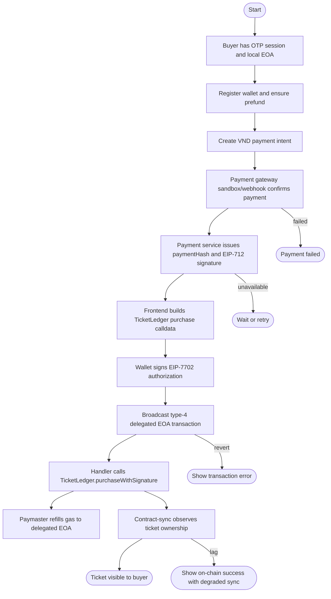
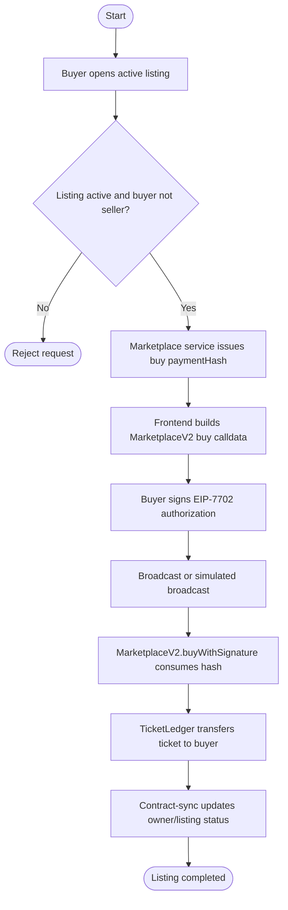
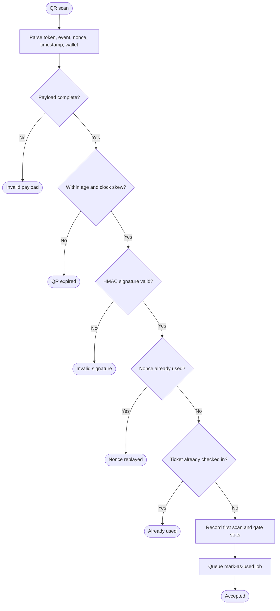
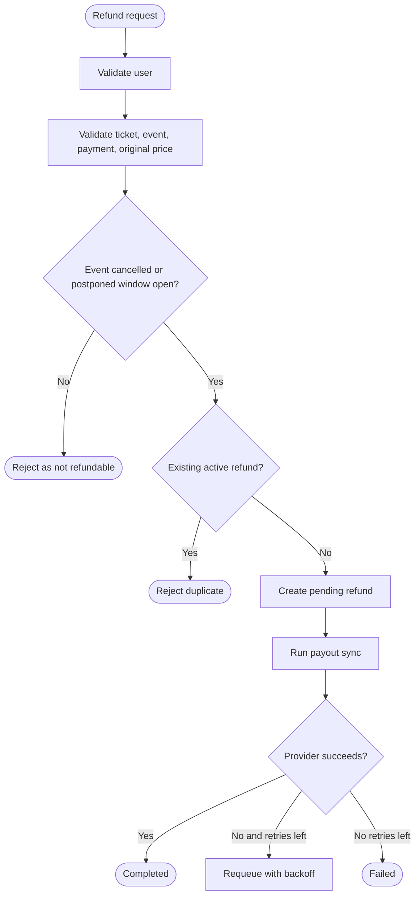
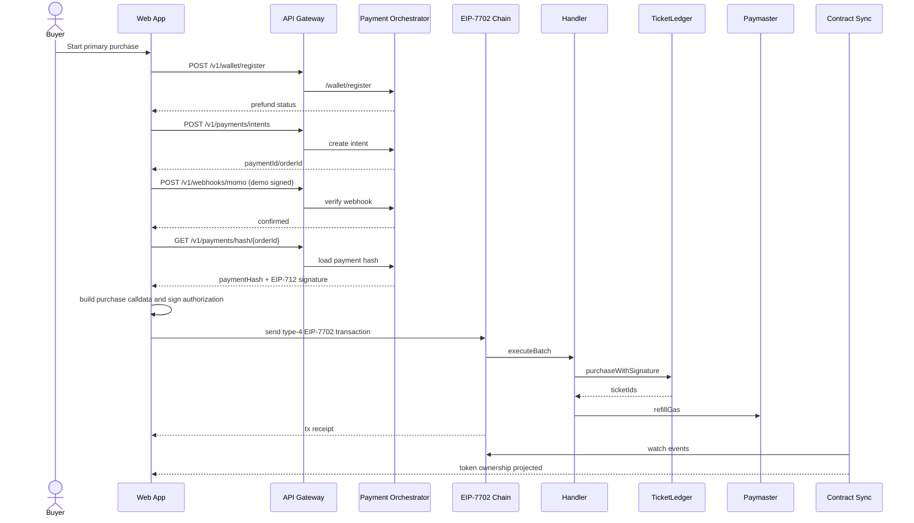
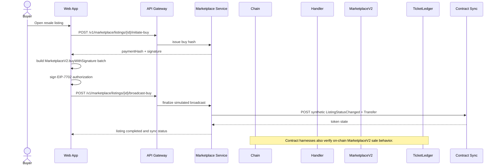
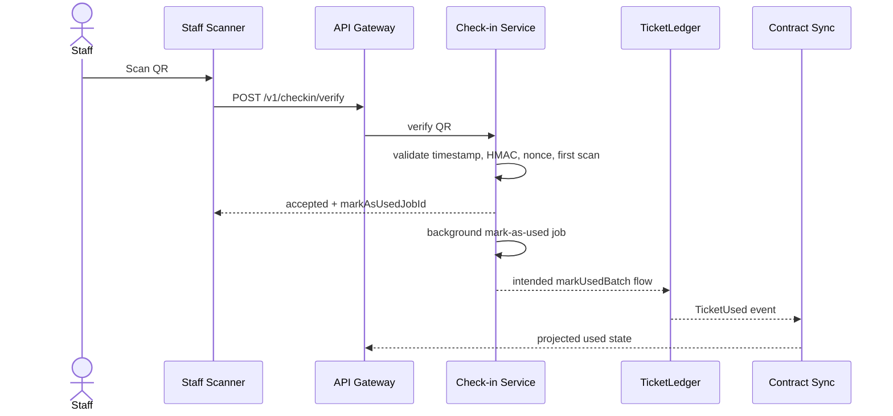
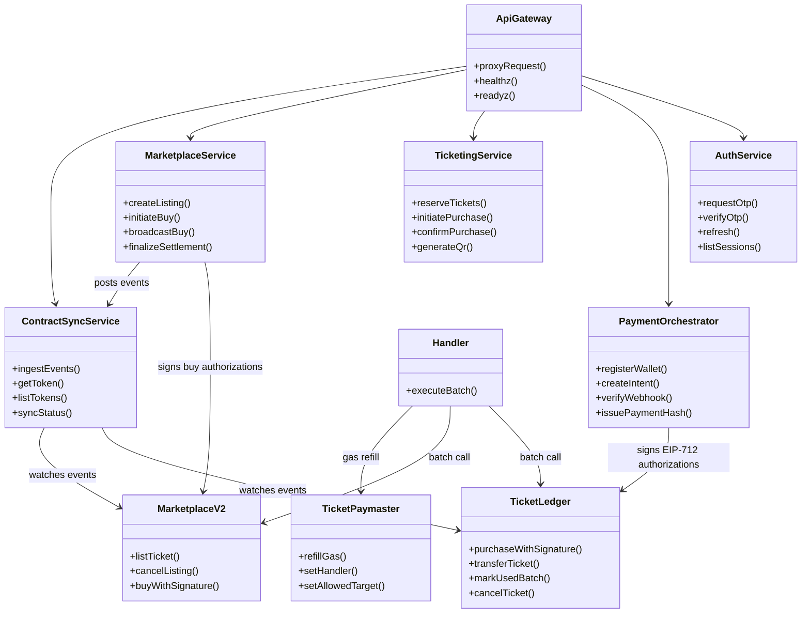
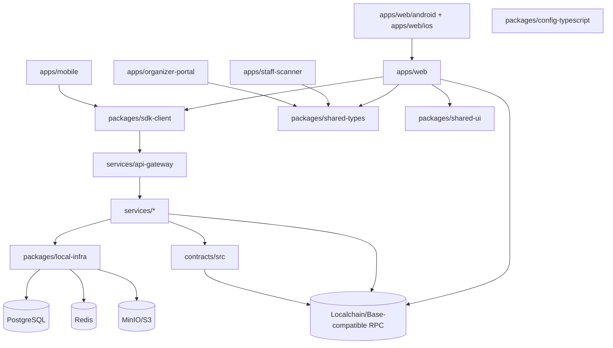
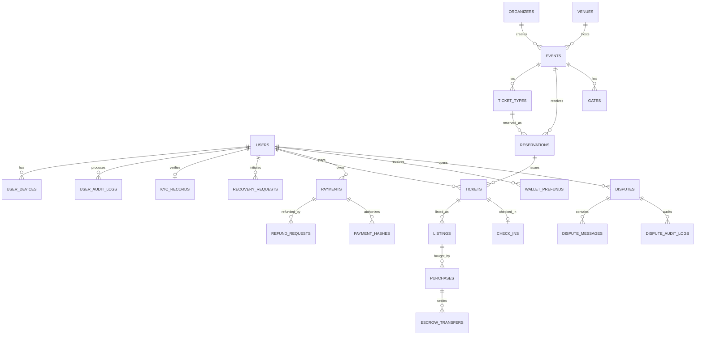

# Technical Development Report: Blockchain-Based Event Ticketing Platform

Last updated: 2026-04-26

## A. Document Audit

### A.1 Audit Method

The repository was audited with the following source-of-truth order:

1. Current source code and deployment scripts.
2. Database migration files and runtime schema creation code.
3. API contracts, SDK types, and tests.
4. Newer migration and product documents.
5. Older requirement, analysis, and design documents for historical context only.

The sample file named "Boarding House Website Report" was not present in this repository or nearby scanned folders. Therefore, this report follows the section structure requested by the maintainer and uses a formal academic report style.

### A.2 Document and Artifact Audit

| Artifact                                                                                        |                       Audit Status | How It Was Used                                                                                                             | Reasoning and Conflicts                                                                                                                                                                                                  |
| ----------------------------------------------------------------------------------------------- | ---------------------------------: | --------------------------------------------------------------------------------------------------------------------------- | ------------------------------------------------------------------------------------------------------------------------------------------------------------------------------------------------------------------------ |
| `README.md`                                                                                     |                               Used | Repository structure, local-chain commands, service ports, quality commands.                                                | Current runbook for the monorepo and local development stack.                                                                                                                                                            |
| `package.json`, `pnpm-workspace.yaml`, `turbo.json`                                             |                               Used | Build orchestration, test commands, workspace layout.                                                                       | Confirms pnpm/turbo monorepo structure and scripts for build, test, contracts, localchain, release gates.                                                                                                                |
| `apps/web/package.json`, `apps/web/capacitor.config.ts`, `apps/web/android/*`, `apps/web/ios/*` |                               Used | Web app packaging, Capacitor scripts, native Android and iOS shell state.                                                   | Confirms the attendee web app is now packageable through Capacitor 8 with app ID `com.entr.ticketplatform` and local `dist` assets. Native folders are generated app shells, not independent production mobile features. |
| `REQUIREMENTS.md`                                                                               |                     Used partially | Initial system request and original scope.                                                                                  | Dated 2026-01-15 and describes NFT/Privy/ERC-4337 assumptions that are superseded by EIP-7702 migration code.                                                                                                            |
| `ANALYSIS.md`                                                                                   |                     Used partially | Early entity analysis, feasibility, use cases, risk register.                                                               | Useful for planning history, but entity model is NFT-era and does not fully match current `TicketLedger` design.                                                                                                         |
| `DESIGN.md`                                                                                     |                     Used partially | Original architecture, service decomposition, early relational model.                                                       | Important historical design, but its `TicketNFT` and ERC-4337 model is not the current local deployment path.                                                                                                            |
| `docs/REQUIREMENTS-UPDATE.md`                                                                   |                     Used partially | Product migration rationale: ledger instead of NFT tickets, hidden wallet UX, payment hash, resale, QR, refunds.            | Newer than root requirements, but several items remain partially implemented or security-sensitive, especially server-side private-key recovery.                                                                         |
| `docs/MIGRATION-BLUEPRINT.md`                                                                   | Used as primary migration document | EIP-7702 delegated EOA, `Handler`, `TicketPaymaster`, `TicketLedger`, `MarketplaceV2`, flow definitions.                    | Aligns strongly with current contracts and frontend transaction builders. Some planned flows such as limit buy and badge NFT are not implemented.                                                                        |
| `docs/BEFORE-MIGRATION.md`                                                                      |                     Used partially | Explains migration rationale and gap assessment.                                                                            | Vietnamese progress note. Useful for history, not final truth when code differs.                                                                                                                                         |
| `IMPLEMENTATION_CHECKLIST.md`                                                                   |                     Used partially | Completion claims and workstream references.                                                                                | Contains many checked items, but code audit shows several features are skeleton, simulated, or not unified with production schema. Treated as status intent, not evidence of production completeness.                    |
| `docs/product/MVP_SCOPE_MOSCOW.md`                                                              |                               Used | MVP scope and feature priorities.                                                                                           | Confirms must-have functions, but "mint worker" terminology is legacy relative to current ledger purchase path.                                                                                                          |
| `docs/product/REQUIREMENT_DECISIONS.md`                                                         |                               Used | Finalized MVP decisions: VND-only, manual organizer onboarding, event creation rules.                                       | Matches current payment gateway direction and event-service organizer header model.                                                                                                                                      |
| `docs/product/PHASE1_BACKLOG_PRIORITIZATION.md`                                                 |                     Used partially | Phase 1+ backlog context.                                                                                                   | Used for future development, not current implementation proof.                                                                                                                                                           |
| `docs/product/PHASE2_ROADMAP.md`                                                                |                               Used | Future development.                                                                                                         | Provides Q2-Q4 2026 roadmap for VNeID, VNPAY, analytics.                                                                                                                                                                 |
| `docs/api/openapi.yaml`                                                                         |                               Used | API contract overview.                                                                                                      | Broad contract source, but actual service routing and implementation must be checked against `services/*/src/server.ts`.                                                                                                 |
| `docs/api/ERROR_CODE_DICTIONARY.md`, `packages/shared-types/src/error-codes.ts`                 |                               Used | Shared error vocabulary.                                                                                                    | Supports standard error descriptions.                                                                                                                                                                                    |
| `infra/db/migrations/*.sql`                                                                     |                Used as DB baseline | User identity, event ticketing, marketplace escrow, payments, refunds, check-in, disputes, wallet prefunds, payment hashes. | Primary schema baseline, but services also create runtime tables that do not fully match migrations.                                                                                                                     |
| `infra/db/README.md`, `infra/db/seeds/dev_seed.sql`                                             |                     Used partially | Database operation and seed context.                                                                                        | Supplementary only.                                                                                                                                                                                                      |
| `docs/db/DATA_RETENTION_AND_PII_ENCRYPTION.md`                                                  |                     Used partially | Security and privacy design.                                                                                                | Describes intended retention/encryption controls; not fully verified in service code.                                                                                                                                    |
| `docs/frontend/APP_FOUNDATIONS.md`                                                              |                     Used partially | Frontend foundation intent for mobile, scanner, organizer.                                                                  | Matches app package structure, but web app is more complete than mobile/staff/organizer skeletons.                                                                                                                       |
| `docs/superpowers/specs/2026-04-21-flow0-registration-wallet-bootstrap-design.md`               |                     Used partially | Recent onboarding design context.                                                                                           | Validated against `apps/web/src/features/onboarding/*`.                                                                                                                                                                  |
| `docs/superpowers/plans/2026-04-21-flow0-registration-wallet-bootstrap-implementation.md`       |                     Used partially | Recent onboarding implementation plan.                                                                                      | Used as supporting context; code is primary.                                                                                                                                                                             |
| `docs/superpowers/specs/2026-04-21-home-discover-design.md`                                     |                     Used partially | Home/discover UI design intent.                                                                                             | Validated against web `HomePage`, discover components, and fallback data.                                                                                                                                                |
| `docs/superpowers/plans/2026-04-21-home-discover-implementation.md`                             |                     Used partially | Home/discover implementation plan.                                                                                          | Supporting context only.                                                                                                                                                                                                 |
| `docs/infra/architecture-diagrams/*`                                                            |                     Used partially | Existing diagram intent.                                                                                                    | PlantUML artifacts exist, but this report regenerates diagrams in Mermaid.                                                                                                                                               |
| `docs/ENVIRONMENT_STRATEGY.md`                                                                  |                               Used | Environment and config rules.                                                                                               | Matches typed service config pattern and gateway service routing variables.                                                                                                                                              |
| `docs/infra/INTEGRATIONS_SETUP.md`                                                              |                     Used partially | Third-party integration plan.                                                                                               | Intended integrations include Base RPC, Privy, Momo, VNPAY, eKYC; current code uses sandbox/local implementations.                                                                                                       |
| `docs/infra/SECRETS_ROTATION_POLICY.md`                                                         |                     Used partially | Security operations context.                                                                                                | Intended operational policy, not fully verifiable from code.                                                                                                                                                             |
| `infra/terraform/README.md`, `infra/terraform/modules/*/README.md`                              |                               Used | Infrastructure design.                                                                                                      | Documents VPC, DB, observability, edge, secrets modules.                                                                                                                                                                 |
| `infra/docker/README.md`, `docker-compose.yml`                                                  |                               Used | Local infrastructure.                                                                                                       | `docker-compose.yml` is current source for Postgres, Redis, MinIO local dependencies.                                                                                                                                    |
| `docs/testing/INTEGRATION_TEST_MATRIX.md`                                                       |                               Used | Verification coverage.                                                                                                      | Summarizes critical journeys and non-functional tests.                                                                                                                                                                   |
| `docs/testing/UNIT_TEST_TARGETS.md`                                                             |                               Used | Test target expectations.                                                                                                   | Defines coverage goals, but not all services currently demonstrate persisted production-grade tests.                                                                                                                     |
| `docs/testing/UAT_CHECKLIST.md`                                                                 |                     Used partially | UAT context.                                                                                                                | Used for future validation, not implementation proof.                                                                                                                                                                    |
| `packages/integration-suite/tests/*`                                                            |          Used as API/test evidence | Flow 0, Flow 1, Flow 2, Flow 4, Flow 5, critical journeys, contract-sync, quality gates.                                    | Strong evidence for sandbox/integration behavior.                                                                                                                                                                        |
| `.github/workflows/ci.yml`, `cd.yml`, `contracts-deploy.yml`                                    |                               Used | CI/CD design.                                                                                                               | Confirms planned gates, but not proof that all gates pass in the current local environment.                                                                                                                              |
| `docs/ci/*`, `docs/release/*`                                                                   |                     Used partially | Pipeline, staging parity, release/rollback governance.                                                                      | Operational design evidence, not runtime behavior.                                                                                                                                                                       |
| `docs/security/*`, `docs/contracts/*`, `docs/ops/*`, `docs/signoff/*`                           |                     Used partially | Security, governance, audit, launch readiness, operations.                                                                  | Treated as target controls and launch process. Some claims require maintainer confirmation because code still has defaults, mocks, and local secrets for development.                                                    |
| `services/*/README.md`                                                                          |                     Used partially | Service responsibilities.                                                                                                   | Cross-checked against `services/*/src/server.ts`; code wins when routes differ.                                                                                                                                          |
| `packages/local-infra/src/index.ts`                                                             |                               Used | Shared Postgres, Redis, and MinIO/S3 helper layer.                                                                          | Confirms local infra clients are centralized and used by the services that now persist runtime state.                                                                                                                    |
| `apps/web/README.md`                                                                            |          Not used as product truth | Stack boilerplate only.                                                                                                     | It appears to be generic Vite/Lovable context, not system architecture truth.                                                                                                                                            |
| `contracts/deployments/README.md`                                                               |                     Used partially | Deployment artifact context.                                                                                                | Actual deploy scripts are primary.                                                                                                                                                                                       |
| `GIT_WORKFLOW_RULE.md`, `CONTRIBUTING.md`                                                       |                     Used partially | Process context.                                                                                                            | Not relevant to system behavior.                                                                                                                                                                                         |

### A.3 Source Code Audit Summary

| Code Area                                                |                         Audit Status | Technical Findings                                                                                                                                                                                                                                                      |
| -------------------------------------------------------- | -----------------------------------: | ----------------------------------------------------------------------------------------------------------------------------------------------------------------------------------------------------------------------------------------------------------------------- |
| `contracts/src/TicketLedger.sol`                         |                       Primary source | Current ticket system is ledger-based, not ERC-721 ticket NFT based. It supports EIP-712 purchase signatures, replay protection, owner indexes, transfer, check-in marking, and cancellation.                                                                           |
| `contracts/src/MarketplaceV2.sol`                        |                       Primary source | Current resale contract supports ticket escrow through `TicketLedger.transferTicket`, listing, buy signatures, payment-hash replay protection, and seller pending payouts.                                                                                              |
| `contracts/src/Handler.sol`, `TicketPaymaster.sol`       |                       Primary source | Implements delegated EOA batch execution and same-transaction gas refill for authorized handlers and targets.                                                                                                                                                           |
| `contracts/script/DeployLocalPlatform.s.sol`             |                       Primary source | Current local deployment includes `TicketLedger`, `MarketplaceV2`, `TicketPaymaster`, and `Handler`. It does not deploy `TicketNFT` or legacy `Marketplace`.                                                                                                            |
| `contracts/src/TicketNFT.sol`, `Marketplace.sol`         |                       Legacy/partial | Still present and tested, but superseded by `TicketLedger` and `MarketplaceV2` for current localchain flows.                                                                                                                                                            |
| `contracts/src/GuardianAccount.sol`                      |                              Partial | Implements delayed guardian recovery, but current EIP-7702 frontend/backend flow does not clearly integrate it end-to-end.                                                                                                                                              |
| `services/api-gateway/src/server.ts`                     |                       Primary source | Node HTTP gateway routes `/v1/*` to service base URLs and exposes `/healthz`, `/readyz`.                                                                                                                                                                                |
| `services/auth-service/src/server.ts`                    |                       Primary source | OTP request/verify, rate limits, token refresh, session listing/revoke backed by Postgres runtime tables.                                                                                                                                                               |
| `services/user-service/src/server.ts`                    |                       Primary source | Profile, email, device, freeze/unfreeze, audit-log behavior backed by Postgres runtime tables that diverge from migration names.                                                                                                                                        |
| `services/event-service/src/server.ts`                   |                       Primary source | Event catalog, detail, availability, organizer create/update/cancel, seeded demo events, and Postgres event/ticket-type persistence.                                                                                                                                    |
| `services/ticketing-service/src/server.ts`               |          Partial/current plus legacy | Reservation TTL, Postgres inventory/reservation/ticket persistence, Redis idempotency cache, and event-service inventory sync are implemented. Purchase confirmation still creates mock tickets and QR payloads, which conflicts with the current on-chain ledger flow. |
| `services/payment-orchestrator/src/server.ts`            |                       Primary source | Postgres-backed wallet register/prefund, payment intents, signed webhooks, retry/reconciliation, payment hash and EIP-712 signature issuance.                                                                                                                           |
| `services/marketplace-service/src/server.ts`             |            Primary plus transitional | Postgres-backed listings, completed sales, settlement ledger, idempotency, buy-hash issuance, legacy escrow settlement endpoints, and current MarketplaceV2 buy-hash/broadcast endpoints. Broadcast path is simulated and posts synthetic events to contract-sync.      |
| `services/checkin-service/src/server.ts`                 |                      Partial/current | QR verification, replay prevention, first-scan-wins, stats, async mark-as-used job. Uses HMAC skeleton and in-memory storage.                                                                                                                                           |
| `services/refund-service/src/server.ts`                  |                      Partial/current | Eligibility policy, idempotency, payout retry simulation, user refund list. In-memory service skeleton.                                                                                                                                                                 |
| `services/recovery-service/src/server.ts`                |                      Partial/current | Multi-channel verification, hold timer, guardian rotation status. In-memory service skeleton.                                                                                                                                                                           |
| `services/dispute-service/src/server.ts`                 |                      Partial/current | Dispute creation, auto rules, message thread, escalation, internal moderation. In-memory service skeleton.                                                                                                                                                              |
| `services/kyc-service/src/server.ts`                     |                      Partial/current | KYC initiation, document upload, face-match thresholds, provider fallback, MinIO archive, and Postgres workflow tables.                                                                                                                                                 |
| `services/notification-service/src/server.ts`            |                     Current skeleton | Template-based SMS/email/push queue with retry simulation. In-memory service skeleton.                                                                                                                                                                                  |
| `services/contract-sync-service/src/*`                   |                       Primary source | Ingests contract events, deduplicates by `txHash:logIndex`, projects token owner/listing/used/refund state; optional viem RPC listener supports legacy and current events.                                                                                              |
| `services/worker-mint/src/server.ts`                     |                       Legacy/partial | NFT-era mint worker remains as retry/support queue skeleton. Not part of current ledger purchase deployment.                                                                                                                                                            |
| `apps/web/src/*`, `apps/web/android/*`, `apps/web/ios/*` |              Primary frontend source | React/Vite web app with onboarding, home/discover, tickets, profile, primary purchase, marketplace, resale purchase, static trade/transaction screens, localchain EIP-7702 broadcast helpers, and generated Capacitor Android/iOS shells.                               |
| `apps/mobile/src/*`                                      |                              Partial | Separate TypeScript mobile app foundation and pure purchase transaction builder; not a full UI and separate from the Capacitor shell generated under `apps/web`.                                                                                                        |
| `apps/staff-scanner/src/*`                               |                              Partial | Minimal scanner logic and metrics skeleton.                                                                                                                                                                                                                             |
| `apps/organizer-portal/src/*`                            |                              Partial | Minimal event CRUD and analytics logic skeleton.                                                                                                                                                                                                                        |
| `packages/sdk-client/src/*`                              |           Primary integration source | Typed API client, EIP-7702 transaction builders, purchase and marketplace buy calldata builders.                                                                                                                                                                        |
| `packages/shared-types/src/*`                            |          Primary shared model source | Shared view types and error dictionary; some currency types remain broader than MVP VND-only.                                                                                                                                                                           |
| `packages/local-infra/src/index.ts`                      | Primary shared infrastructure source | Provides Postgres, Redis, and MinIO/S3 client factories used by persisted service implementations.                                                                                                                                                                      |

### A.4 Main Contradictions Found

| Topic                      | Documentation Claim                                                         | Current Code Evidence                                                                                                                                                                     | Report Treatment                                                                                  |
| -------------------------- | --------------------------------------------------------------------------- | ----------------------------------------------------------------------------------------------------------------------------------------------------------------------------------------- | ------------------------------------------------------------------------------------------------- |
| Ticket representation      | Early docs describe NFT tickets using `TicketNFT`.                          | Current local deployment uses `TicketLedger`; `TicketNFT` is not deployed by `DeployLocalPlatform.s.sol`.                                                                                 | Current report treats ledger tickets as source of truth and NFT docs as historical.               |
| Wallet architecture        | Early docs describe Privy and ERC-4337 account abstraction.                 | Current code uses local EOA generation, EIP-7702 authorization, `Handler`, and `TicketPaymaster`.                                                                                         | Current report describes EIP-7702 delegated EOA architecture.                                     |
| Mint worker                | MVP docs mention mint worker.                                               | `worker-mint` exists, but current purchase flow uses `paymentHash` plus frontend type-4 transaction into `TicketLedger`.                                                                  | Mint worker is classified as legacy/sandbox.                                                      |
| Database schema            | Migrations define many normalized tables with UUIDs and NFT-era `token_id`. | Services also create runtime tables with text IDs and divergent names such as `ticket_inventory`, `payment_intents`, `marketplace_buy_hashes`.                                            | Report notes DB migration baseline is not fully unified with runtime schemas.                     |
| Marketplace settlement     | Legacy docs and service endpoints describe escrow settlement payloads.      | `MarketplaceV2` records full seller pending payout on-chain; service calculates fees/royalties off-chain.                                                                                 | Report marks fee settlement as transitional and requiring final authority.                        |
| QR model                   | Migration says QR per account.                                              | `ticketing-service` and `checkin-service` currently use token/ticket QR payloads with HMAC signatures.                                                                                    | Report describes current HMAC/token QR and flags account-QR as open question.                     |
| Security posture           | Security docs describe hardening, audits, signoffs.                         | Code has dev defaults, demo private keys, simulated webhooks, and skeleton services.                                                                                                      | Report treats security docs as target controls, not proof of production readiness.                |
| Service persistence        | Several service README files still describe in-memory skeletons.            | Current code and root README show Postgres persistence for auth, user, event, ticketing, payment, marketplace, and KYC, plus Redis for ticketing idempotency and MinIO for KYC snapshots. | Report treats code and root README as newer truth while keeping schema drift as a production gap. |
| Native app status          | Product docs mention separate mobile and staff/organizer surfaces.          | `apps/web` now has Capacitor Android/iOS shells, while `apps/mobile`, `apps/staff-scanner`, and `apps/organizer-portal` remain TypeScript logic foundations.                              | Report distinguishes web-to-native packaging from fully implemented native/mobile apps.           |
| Ticket trade / atomic swap | UI text describes P2P trade, blockchain verification, and atomic swap.      | `apps/web` contains trade and transaction pages with static local data, but no backend or contract atomic-swap flow was found.                                                            | Report classifies trade screens as UI prototypes, not implemented marketplace settlement logic.   |

## B. Final Report

## I. Team Members

The repository does not contain a maintained team-member document. The following roles are therefore inferred from the system structure rather than attributed to named individuals.

| Role                             | Responsibility in This System                                                        | Evidence                                                                      |
| -------------------------------- | ------------------------------------------------------------------------------------ | ----------------------------------------------------------------------------- |
| Product Analyst                  | Requirements, MVP scope, roadmap, requirement decisions.                             | `REQUIREMENTS.md`, `docs/product/*`, `docs/REQUIREMENTS-UPDATE.md`            |
| Backend Engineer                 | API gateway and service implementations.                                             | `services/*/src/server.ts`                                                    |
| Frontend Engineer                | Web buyer app, onboarding, primary purchase, marketplace, localchain interaction.    | `apps/web/src/*`                                                              |
| Smart Contract Engineer          | Ledger, marketplace, delegated handler, paymaster, guardian recovery, Foundry tests. | `contracts/src/*`, `contracts/test/*`, `contracts/script/*`                   |
| Infrastructure Engineer          | Docker, Terraform, environment strategy, CI/CD, release gates.                       | `docker-compose.yml`, `infra/terraform/*`, `.github/workflows/*`, `scripts/*` |
| Security and Operations Reviewer | Security controls, audits, runbooks, launch readiness.                               | `docs/security/*`, `docs/ops/*`, `docs/release/*`                             |

## II. Introduction

The project is a blockchain-based event ticketing platform for Vietnam-oriented ticket commerce. Its purpose is to reduce counterfeit tickets, constrain abusive resale, preserve familiar payment flows in VND, and support real-time event entry through verifiable ticket ownership.

The current implementation has migrated away from the original NFT-ticket and ERC-4337 design. The active localchain architecture uses a ledger smart contract (`TicketLedger`) to represent ticket ownership, an EIP-7702 delegated EOA execution model through `Handler`, and a `TicketPaymaster` that sponsors gas by refilling the delegated EOA after authorized batch execution. Payment confirmation is not performed directly on-chain by payment gateways; instead, the backend verifies signed MoMo/VNPAY-style webhooks and issues EIP-712 payment authorizations consumed by the buyer or reseller through frontend-built transactions.

The system is organized as a monorepo containing smart contracts, backend services, frontend applications, shared SDK packages, database migrations, infrastructure templates, CI/CD workflows, and testing suites. The repository also contains legacy components from the NFT-era architecture, especially `TicketNFT`, legacy `Marketplace`, and `worker-mint`. These are retained in the codebase but are not the current local deployment path.

The local backend state is no longer purely in-memory. Auth, user, event, ticketing, payment-orchestrator, marketplace, and KYC services create and use Postgres runtime tables; ticketing also uses Redis for idempotency; KYC uses MinIO/S3-compatible archival. Check-in, refund, recovery, dispute, notification, worker-mint, and contract-sync projection still rely mainly on in-memory or mock state. The primary attendee app is `apps/web`; it now includes generated Capacitor Android and iOS projects around the Vite build output, but those native folders should be treated as packaging scaffolds until secure storage, native QA, and app-store release controls are completed.

## III. Planning

### 1. Reason to Select Project

The project addresses a concrete commerce problem: digital ticket distribution must maintain authenticity, limit resale abuse, support high-concurrency sales, and preserve a simple user experience for buyers who may not understand blockchain. The selected architecture tries to combine conventional payment rails, backend service orchestration, and on-chain ownership verification.

From the repository evidence, the project was selected because it has clear end-user value and technical depth:

| Motivation                    | Technical Implication                                                                               | Evidence                                                                   |
| ----------------------------- | --------------------------------------------------------------------------------------------------- | -------------------------------------------------------------------------- |
| Prevent counterfeit tickets   | Ticket ownership and usage state should be verifiable through a ledger or contract sync projection. | `TicketLedger.sol`, `contract-sync-service`                                |
| Preserve familiar payments    | VND payments through MoMo/VNPAY are the MVP payment rail.                                           | `docs/product/REQUIREMENT_DECISIONS.md`, `payment-orchestrator`            |
| Reduce blockchain UX friction | Frontend hides wallet creation and builds EIP-7702 transactions.                                    | `apps/web/src/features/onboarding/*`, `apps/web/src/lib/localchain.ts`     |
| Limit resale abuse            | Marketplace markup cap and KYC gate.                                                                | `MarketplaceV2.sol`, `marketplace-service`                                 |
| Support event operations      | QR verification, check-in metrics, refund, recovery, disputes.                                      | `checkin-service`, `refund-service`, `recovery-service`, `dispute-service` |

### 2. Initial System Request

The initial request, reconstructed from `REQUIREMENTS.md`, `ANALYSIS.md`, and `DESIGN.md`, was to build a blockchain-enabled ticketing system with:

| Requirement Area        | Original Intent                                                | Current Status                                                                                                                   |
| ----------------------- | -------------------------------------------------------------- | -------------------------------------------------------------------------------------------------------------------------------- |
| Authentication          | Phone OTP and session management.                              | Implemented in `auth-service`; web onboarding consumes it.                                                                       |
| Wallet                  | Embedded wallet abstraction with gas sponsorship.              | Migrated to local EOA plus EIP-7702 authorization and paymaster refill.                                                          |
| Primary purchase        | Reserve ticket, pay through VND gateway, mint or issue ticket. | Implemented through reservation/payment services and current ledger authorization flow; old mock ticketing flow still exists.    |
| Ticket ownership        | On-chain proof of ownership.                                   | Current source is `TicketLedger` and contract-sync projection.                                                                   |
| Marketplace             | KYC-gated resale with markup cap.                              | Implemented in transitional service and `MarketplaceV2`; off-chain fee settlement remains partly simulated.                      |
| Ticket trade            | P2P ticket exchange or trade proposal flow.                    | UI prototype exists in `apps/web`; no backend or smart-contract atomic-swap implementation was found.                            |
| Check-in                | QR verification and duplicate prevention.                      | Implemented as HMAC skeleton and integration tests; chain mark-as-used is tested with harness.                                   |
| Refund                  | Event cancellation and refund handling.                        | Implemented as service skeleton plus `TicketLedger.cancelTicket` harness.                                                        |
| Recovery                | Lost-device and guardian recovery.                             | Service skeleton and `GuardianAccount` exist, but end-to-end integration remains unclear.                                        |
| Disputes                | Support escalation and audit trail.                            | Service skeleton supports cases, messages, escalation, moderation.                                                               |
| Native mobile packaging | Mobile-ready buyer experience.                                 | `apps/web` can be wrapped through Capacitor 8 for Android and iOS; separate `apps/mobile` remains a TypeScript logic foundation. |

### 3. Feasibility Analysis

| Dimension                    | Assessment                                                                             | Justification                                                                                                                                                                                    |
| ---------------------------- | -------------------------------------------------------------------------------------- | ------------------------------------------------------------------------------------------------------------------------------------------------------------------------------------------------ |
| Technical feasibility        | Feasible as a local/sandbox architecture; production readiness requires consolidation. | Contracts, persisted core services, SDK, frontend, Capacitor packaging, and integration tests demonstrate main flows, but runtime schemas and in-memory secondary services still need hardening. |
| Economic feasibility         | Feasible for MVP because VND-only reduces settlement and compliance complexity.        | `REQUIREMENT_DECISIONS.md` disables USDT for MVP and payment service restricts currency to VND.                                                                                                  |
| Operational feasibility      | Partially feasible; runbooks and CI/CD exist, but implementation maturity varies.      | `docs/ops/*`, `.github/workflows/*`, `scripts/*`; many service endpoints are skeletons.                                                                                                          |
| Legal/compliance feasibility | Requires continued validation.                                                         | VN compliance docs exist, but private-key recovery, KYC provider handling, data retention, and blockchain framing need maintainer confirmation.                                                  |
| Schedule feasibility         | Feasible for demo/MVP pilot, not yet confirmed for production.                         | Flow tests cover critical journeys, but open schema and mock/simulation gaps remain.                                                                                                             |

### 4. Initial Project Plan

| Phase                         | Objective                                                                                                                               | Repository Evidence                                                                                          | Current Interpretation                                                                                                  |
| ----------------------------- | --------------------------------------------------------------------------------------------------------------------------------------- | ------------------------------------------------------------------------------------------------------------ | ----------------------------------------------------------------------------------------------------------------------- |
| Planning                      | Define ticketing domain, MVP, risks.                                                                                                    | `REQUIREMENTS.md`, `ANALYSIS.md`, `docs/product/*`                                                           | Completed historically.                                                                                                 |
| Architecture design           | Define services, contracts, database, integrations.                                                                                     | `DESIGN.md`, `docs/MIGRATION-BLUEPRINT.md`, `infra/db/migrations/*`                                          | Migrated from NFT/ERC-4337 to ledger/EIP-7702.                                                                          |
| Contract implementation       | Implement ticket ledger, resale, handler, paymaster.                                                                                    | `contracts/src/*`, `contracts/test/*`                                                                        | Current localchain contracts are present and tested.                                                                    |
| Backend implementation        | Implement gateway, auth, KYC, event, ticketing, payment, marketplace, check-in, refund, recovery, dispute, notification, contract sync. | `services/*`                                                                                                 | Implemented as a mixture of runtime services, sandbox services, and skeletons.                                          |
| Frontend implementation       | Implement buyer app flows and supporting apps.                                                                                          | `apps/web`, `apps/web/android`, `apps/web/ios`, `apps/mobile`, `apps/staff-scanner`, `apps/organizer-portal` | Web app is most complete and now has Capacitor shells; trade screens are static prototypes; other apps are foundations. |
| Infrastructure and deployment | Local infra, Terraform, CI/CD, release gates.                                                                                           | `docker-compose.yml`, `infra/terraform`, `.github/workflows`, `scripts`                                      | Design exists; local compose is concrete.                                                                               |
| Verification                  | Unit, integration, e2e, load, chaos, contract gates.                                                                                    | `packages/integration-suite`, `contracts/test`, `docs/testing/*`                                             | Good sandbox coverage; production parity remains open.                                                                  |

## IV. Analysis

### 1. General Use Case Diagram

### 2. Use Case Descriptions

| Use Case                       | Actor             | Trigger                                          | Precondition                                                                            | Postcondition                                                                                 | Error Situations                                                                                                 | Standard Process                                                                                                                                                                 | Alternative Process                                                                                     |
| ------------------------------ | ----------------- | ------------------------------------------------ | --------------------------------------------------------------------------------------- | --------------------------------------------------------------------------------------------- | ---------------------------------------------------------------------------------------------------------------- | -------------------------------------------------------------------------------------------------------------------------------------------------------------------------------- | ------------------------------------------------------------------------------------------------------- |
| Register and Bootstrap Wallet  | Buyer             | User enters phone and OTP.                       | Auth service is available; phone format is valid.                                       | Session tokens and local wallet are stored; wallet is registered and prefunded.               | Rate limit, expired OTP, invalid OTP, prefund delay, wallet mismatch.                                            | Request OTP, verify OTP, create local EOA, register wallet with payment service, poll prefund.                                                                                   | If prefund is delayed, retry through onboarding controller.                                             |
| Browse Events                  | Buyer             | User opens home/discover.                        | Event service is available or fallback data exists.                                     | User sees active event list and event details.                                                | Event service unavailable.                                                                                       | Web app calls SDK `listEvents`, fetches details, maps to poster cards.                                                                                                           | Fallback poster data is shown with warning.                                                             |
| Reserve Tickets                | Buyer             | User selects event, tier, quantity.              | Inventory exists and quantity is 1..4.                                                  | Reservation is pending with TTL and locked inventory.                                         | Sold out, invalid quantity, duplicate idempotency key, expired reservation.                                      | Ticketing service locks inventory in transaction and returns reservation.                                                                                                        | Existing idempotent result is returned for duplicate key.                                               |
| Primary Purchase               | Buyer             | User starts purchase flow.                       | Wallet exists, payment amount and ticket parameters are valid.                          | `TicketLedger` mints ledger tickets to buyer after EIP-712 payment authorization is consumed. | Payment hash unavailable, invalid backend signature, reused payment hash, transaction revert, contract-sync lag. | Register wallet, create payment intent, confirm signed webhook, fetch payment hash, build EIP-7702 transaction, sign authorization, broadcast to localchain, poll contract-sync. | If contract-sync lags but on-chain owner has changed, frontend marks result as degraded.                |
| List Ticket for Resale         | Reseller          | Seller submits listing.                          | Seller is authenticated, KYC approved, ticket is transferable, ask price is within cap. | Listing is active in service and/or on-chain marketplace.                                     | KYC required, invalid price, markup exceeded, ticket already listed, ticket not escrowed.                        | Seller transfers ticket to marketplace, lists with price, backend stores listing.                                                                                                | Legacy service can create off-chain listing without on-chain escrow in sandbox.                         |
| Buy Resale Ticket              | Buyer             | Buyer selects active marketplace listing.        | Listing is active, buyer is not seller, payment/signing configured.                     | Ticket transfers to buyer and listing becomes completed.                                      | Self-purchase, invalid listing ID, buy hash expired, invalid signature, sync failure.                            | Backend issues buy hash, frontend builds `MarketplaceV2.buyWithSignature`, buyer signs EIP-7702 authorization, broadcast/finalize, contract-sync updates owner.                  | Current web resale broadcast endpoint simulates tx and posts synthetic sync events.                     |
| Browse or Propose Ticket Trade | Buyer or Reseller | User opens the trade marketplace screens.        | User has local/static ticket data in the web UI.                                        | User can inspect or compose a trade proposal UI state.                                        | Missing selected ticket, no matching offers, unsupported negotiation or acceptance.                              | Web UI lets the user select a ticket, browse static trade offers, and review trade transaction screens.                                                                          | No persisted backend workflow or on-chain atomic swap was found; this is currently a prototype surface. |
| Verify Check-in QR             | Gate Staff        | Staff scans QR.                                  | QR payload has token, event, timestamp, nonce, wallet, signature.                       | First valid scan is accepted, stats updated, mark-as-used job queued.                         | Expired QR, invalid signature, replayed nonce, already used ticket.                                              | Verify HMAC, reject replay, write first-scan record, enqueue mark-as-used.                                                                                                       | Background retry may requeue or fail mark-as-used job.                                                  |
| Request Refund                 | Buyer             | Event cancelled or postponed with refund window. | User owns ticket/payment context; event is refundable.                                  | Refund request is queued and eventually completed or failed.                                  | Event not refundable, window closed, duplicate refund, invalid price.                                            | Validate policy, create idempotent refund, process payout sync.                                                                                                                  | Resale premium is excluded from refund amount.                                                          |
| Recover Account                | Buyer             | User reports lost device.                        | User has account and new device fingerprint.                                            | Recovery enters hold after required channels, then guardian rotation can complete.            | Active recovery already exists, missing verification, hold not finished.                                         | Initiate recovery, verify required channels, wait hold duration, rotate guardian.                                                                                                | User may cancel before completion.                                                                      |
| Open and Escalate Dispute      | Buyer or Support  | User files support case.                         | Authenticated user; category, title, description, amount supplied.                      | Dispute is open, auto-resolved, escalated, resolved, or closed.                               | Missing fields, unauthorized access, max tier reached, unsupported moderation action.                            | Create case, append message, compute SLA, escalate if needed.                                                                                                                    | Auto rules can resolve duplicate payment or refund SLA cases.                                           |
| Create or Cancel Event         | Organizer         | Organizer submits or cancels event.              | `x-organizer-id` present; required event fields valid.                                  | Event is active, updated, or cancelled.                                                       | Missing organizer, invalid fields, forbidden owner mismatch.                                                     | Event service creates event and ticket types or cancels owner event.                                                                                                             | Manual organizer onboarding remains outside public self-service.                                        |

### 3. Activity Diagrams

#### 3.1 Primary Purchase Activity

#### 3.2 Resale Purchase Activity

#### 3.3 Check-in Activity

#### 3.4 Refund Activity

### 4. Sequence Diagrams

#### 4.1 Primary Purchase Sequence

#### 4.2 Marketplace Resale Sequence

#### 4.3 Check-in Sequence

### 5. Boundary-Controller-Entity Classes

| Layer      | Classes or Modules                                                                                                                                 | Responsibility                                                                                                                                       |
| ---------- | -------------------------------------------------------------------------------------------------------------------------------------------------- | ---------------------------------------------------------------------------------------------------------------------------------------------------- |
| Boundary   | `apps/web` pages and components                                                                                                                    | Buyer-facing UI for onboarding, discover, tickets, profile, primary purchase, marketplace, resale, and static trade/transaction screens.             |
| Boundary   | `apps/web/android`, `apps/web/ios`                                                                                                                 | Capacitor native shells that package the web attendee app for Android and iOS.                                                                       |
| Boundary   | `apps/mobile/src/index.ts`                                                                                                                         | Mobile buyer app state facade and purchase transaction preparation.                                                                                  |
| Boundary   | `apps/staff-scanner/src/index.ts`                                                                                                                  | Staff scan input and gate metrics facade.                                                                                                            |
| Boundary   | `apps/organizer-portal/src/index.ts`                                                                                                               | Organizer event CRUD and analytics facade.                                                                                                           |
| Boundary   | `services/api-gateway/src/server.ts`                                                                                                               | HTTP API boundary and service routing.                                                                                                               |
| Controller | `auth-service`                                                                                                                                     | OTP lifecycle, sessions, refresh tokens.                                                                                                             |
| Controller | `payment-orchestrator`                                                                                                                             | Payment intents, signed webhooks, wallet prefund, payment hash issuance.                                                                             |
| Controller | `ticketing-service`                                                                                                                                | Reservation, inventory lock, legacy/mock ticket issuance and QR generation.                                                                          |
| Controller | `marketplace-service`                                                                                                                              | Listing lifecycle, resale hash issuance, settlement ledger, simulated broadcast.                                                                     |
| Controller | `contract-sync-service`                                                                                                                            | Contract event ingestion, projection, and query.                                                                                                     |
| Controller | `checkin-service`, `refund-service`, `recovery-service`, `dispute-service`, `notification-service`, `kyc-service`, `event-service`, `user-service` | Domain workflows.                                                                                                                                    |
| Entity     | `TicketLedger`                                                                                                                                     | Ledger ticket ownership, transfer, used state, cancellation.                                                                                         |
| Entity     | `MarketplaceV2`                                                                                                                                    | Resale listing and purchase.                                                                                                                         |
| Entity     | `Handler`, `TicketPaymaster`                                                                                                                       | Delegated EOA execution and gas refill.                                                                                                              |
| Entity     | Database tables                                                                                                                                    | Users, devices, KYC, events, ticket types, reservations, tickets, listings, payments, payment hashes, wallet prefunds, check-ins, refunds, disputes. |

### 6. Class Diagram

## V. Design

### 1. Interface Design and Major Screens

| Interface         | Main Purpose                                                                                           | Implementation Evidence                                                                                                 | Current Maturity                                                                                      |
| ----------------- | ------------------------------------------------------------------------------------------------------ | ----------------------------------------------------------------------------------------------------------------------- | ----------------------------------------------------------------------------------------------------- |
| Home / Discover   | Poster-first event discovery, category filter, preview modal.                                          | `apps/web/src/pages/HomePage.tsx`, `DiscoverPage.tsx`, `features/discover/*`                                            | Implemented with API and fallback data.                                                               |
| Onboarding        | Phone OTP, OTP verify, local wallet creation, wallet registration, prefund polling.                    | `apps/web/src/pages/OnboardingPage.tsx`, `features/onboarding/*`                                                        | Implemented for web/localchain flow.                                                                  |
| Event Detail      | Event metadata and ticket tier navigation.                                                             | `apps/web/src/pages/EventDetailPage.tsx`                                                                                | Implemented with fallback support.                                                                    |
| Primary Purchase  | Payment intent, webhook demo, payment hash, tx draft, signing, localchain broadcast, sync polling.     | `apps/web/src/pages/PrimaryPurchasePage.tsx`                                                                            | Implemented as explicit demo/developer flow.                                                          |
| Tickets           | Upcoming/past tickets and ticket cards.                                                                | `apps/web/src/pages/TicketsPage.tsx`, `hooks/use-tickets.ts`                                                            | Implemented with API/fallback data.                                                                   |
| Marketplace       | Listing browsing and market overview.                                                                  | `apps/web/src/pages/MarketplacePage.tsx`, `hooks/use-marketplace.ts`                                                    | Implemented with active listings and fallback.                                                        |
| Resale Purchase   | Buy hash preparation, transaction draft, signing, broadcast/finalize.                                  | `apps/web/src/pages/ResalePurchasePage.tsx`                                                                             | Implemented as transitional simulated broadcast flow.                                                 |
| Resale Sale       | Ticket selection and price entry.                                                                      | `apps/web/src/pages/ResaleSalePage.tsx`                                                                                 | UI skeleton with static local tickets; not wired end-to-end.                                          |
| Profile           | User profile and summary stats.                                                                        | `apps/web/src/pages/ProfilePage.tsx`                                                                                    | Implemented with API/fallback data.                                                                   |
| Staff Scanner     | QR scan and gate metrics.                                                                              | `apps/staff-scanner/src/*`, `checkin-service`                                                                           | Logic skeleton plus service integration tests.                                                        |
| Organizer Portal  | Event CRUD and analytics.                                                                              | `apps/organizer-portal/src/*`, `event-service`                                                                          | Logic skeleton; event service has actual organizer endpoints.                                         |
| Trade Marketplace | Static P2P trade browse/create, buyer/seller transaction status, and trade transaction review screens. | `apps/web/src/pages/TradePage.tsx`, `SellerTransactionPage.tsx`, `BuyerTransactionPage.tsx`, `TradeTransactionPage.tsx` | UI prototype with static data; not connected to backend persistence or smart-contract atomic swap.    |
| Native App Shell  | Android/iOS wrapper for the attendee web app.                                                          | `apps/web/capacitor.config.ts`, `apps/web/android/*`, `apps/web/ios/*`                                                  | Generated Capacitor shell with app ID `com.entr.ticketplatform`; production native hardening remains. |

### 2. Detailed Classes and Modules

| Module                                                  | Important Types or Functions                                                        | Notes                                                                                         |
| ------------------------------------------------------- | ----------------------------------------------------------------------------------- | --------------------------------------------------------------------------------------------- |
| `packages/sdk-client/src/index.ts`                      | `ApiClient`, `PaymentHashData`, `MarketplaceBuyHashData`, `ContractSyncedTokenData` | Typed client used by web app.                                                                 |
| `packages/sdk-client/src/tx-builder/purchase.ts`        | `buildPurchaseTx`                                                                   | Encodes `TicketLedger.purchaseWithSignature`.                                                 |
| `packages/sdk-client/src/tx-builder/marketplace-buy.ts` | `buildMarketplaceBuyTx`                                                             | Encodes `MarketplaceV2.buyWithSignature`.                                                     |
| `packages/sdk-client/src/tx-builder/encoder.ts`         | `encodeExecuteBatch`, `hashAuthorizationTuple`, `assembleTx4`                       | Core EIP-7702 client transaction construction.                                                |
| `apps/web/src/lib/session.ts`                           | `signSessionAuthorization`, `getSignedSessionTransactionInput`                      | Uses persisted local private key for localchain signing.                                      |
| `apps/web/src/lib/localchain.ts`                        | `sendLocalchainTransaction`, `waitForTransactionReceipt`, owner query helpers       | Localchain broadcast and verification helpers.                                                |
| `apps/web/capacitor.config.ts`                          | `appId`, `appName`, `webDir`                                                        | Configures Capacitor packaging as `com.entr.ticketplatform`, `Entr`, and local `dist` output. |
| `apps/web/src/pages/TradePage.tsx`, transaction pages   | Static trade proposal and transaction-state UI                                      | Demonstrates intended P2P exchange experience but does not persist or settle trades.          |
| `services/payment-orchestrator/src/ethereum.ts`         | EIP-712 signing and wallet prefund helpers                                          | Uses Foundry `cast` and JSON-RPC.                                                             |
| `services/marketplace-service/src/ethereum.ts`          | Marketplace buy hash and signature helpers                                          | EIP-712 `Buy` domain for `MarketplaceV2`.                                                     |
| `services/contract-sync-service/src/event-mapper.ts`    | Event mapper functions                                                              | Maps legacy and current contract events into canonical projection events.                     |
| `services/contract-sync-service/src/rpc-listener.ts`    | `RpcListener`                                                                       | Optional viem watcher for current and legacy contracts.                                       |

### 3. Package Dependency Diagram

### 4. Database Design

The migration baseline is normalized around users, events, ticketing, marketplace, payments, refunds, check-in, disputes, wallet prefunds, and payment hashes. Current service code also creates additional runtime tables independently. This runtime persistence is useful for the local stack, but it is still a design gap: a production system should converge on one migration-owned schema and avoid duplicate concepts such as `reservations` versus `ticket_inventory` or `payments` versus `payment_intents`.

### 5. Smart Contract Design

| Contract          | Responsibility                                                                            | Current Role                                                             |
| ----------------- | ----------------------------------------------------------------------------------------- | ------------------------------------------------------------------------ |
| `TicketLedger`    | Ledger ticket issuance, transfer, check-in state, cancellation, replay-safe payment hash. | Canonical current ticket contract.                                       |
| `MarketplaceV2`   | Resale listing, buy authorization, ticket transfer, pending seller payout.                | Canonical current marketplace contract.                                  |
| `Handler`         | EIP-7702 delegated batch executor with target allowlist check through paymaster.          | Canonical transaction execution layer.                                   |
| `TicketPaymaster` | Gas sponsorship treasury with authorized handlers and targets.                            | Canonical gas refill layer.                                              |
| `GuardianAccount` | Delayed guardian recovery account.                                                        | Implemented but not fully integrated into current frontend/backend flow. |
| `TicketNFT`       | ERC-721 ticket implementation.                                                            | Legacy/currently not deployed in local platform.                         |
| `Marketplace`     | ERC-721 custody resale marketplace.                                                       | Legacy/currently superseded by `MarketplaceV2`.                          |

## VI. Implementation

### 1. Backend Implementation

| Service               | Implemented Responsibilities                                                                                                                                        | Important Limitations                                                                                     |
| --------------------- | ------------------------------------------------------------------------------------------------------------------------------------------------------------------- | --------------------------------------------------------------------------------------------------------- |
| API Gateway           | Health, readiness, route proxying to 13 services.                                                                                                                   | Lightweight Node HTTP proxy, no centralized auth enforcement beyond headers.                              |
| Auth Service          | OTP request/verify, access/refresh tokens, session/device records, rate limits, Postgres runtime persistence.                                                       | Development OTP exposure can be enabled; schema is service-owned rather than migration-owned.             |
| User Service          | Profile, email backup, devices, freeze/unfreeze, audit logs, Postgres runtime persistence.                                                                          | Runtime schema diverges from migration baseline.                                                          |
| KYC Service           | Provider fallback, document upload, face match, Postgres workflow state, MinIO archival.                                                                            | Sandbox thresholds and provider simulation.                                                               |
| Event Service         | Event browse/detail, ticket types, availability, organizer create/update/cancel, Postgres event persistence.                                                        | Seeded demo events; organizer onboarding remains manual.                                                  |
| Ticketing Service     | Reservation TTL, inventory lock, purchase initiation, internal confirm, QR generation, Postgres persistence, Redis idempotency cache, event-service inventory sync. | Mock ticket IDs and QR generation conflict with final ledger ownership model.                             |
| Payment Orchestrator  | Wallet registration, one-time prefund, payment intents, signed webhooks, nonce replay protection, payment hash issuance, Postgres persistence.                      | Uses dev signer defaults and `cast` helpers; real provider integration requires production configuration. |
| Marketplace Service   | Listing CRUD, KYC gate, markup cap, legacy settlement, buy hash issuance, simulated broadcast and sync events, Postgres persistence.                                | Transitional mix of old escrow and new MarketplaceV2 flow.                                                |
| Check-in Service      | QR validation, duplicate prevention, stats, mark-as-used queue.                                                                                                     | In-memory state and HMAC QR skeleton; final chain update is represented in tests/harnesses.               |
| Refund Service        | Policy validation, idempotency, payout retry simulation.                                                                                                            | In-memory state; production payout provider integration is not complete in code.                          |
| Recovery Service      | Multi-channel verification, hold timer, guardian rotation state.                                                                                                    | In-memory service and unclear integration with `GuardianAccount`.                                         |
| Dispute Service       | Case creation, auto rules, messaging, escalation, moderation.                                                                                                       | In-memory service; evidence storage is not production-grade.                                              |
| Notification Service  | Templates, event-driven notifications, retry simulation.                                                                                                            | In-memory queue; provider integrations are simulated.                                                     |
| Contract Sync Service | Event ingestion, deduplication, token state projection, optional RPC listener.                                                                                      | In-memory projection; persistence strategy is not migration-owned.                                        |
| Worker Mint           | Retry/support queue for NFT-style mint jobs.                                                                                                                        | Legacy relative to current ledger flow.                                                                   |

### 2. Frontend Implementation

The web application is the most complete frontend surface. It uses React 18, Vite, React Router, React Query, Tailwind, Radix-style UI components, lucide icons, and the monorepo SDK client.

Implemented frontend flows include:

| Flow                          | Implementation                                                                                                                                               |
| ----------------------------- | ------------------------------------------------------------------------------------------------------------------------------------------------------------ |
| Onboarding                    | State machine persists draft/session, generates local EOA using `viem/accounts`, registers wallet, polls prefund.                                            |
| Home/discover                 | Poster-first event browsing with API-backed catalog and fallback data.                                                                                       |
| Primary purchase              | Creates payment intent, submits demo webhook, fetches payment hash, builds EIP-7702 transaction, signs, broadcasts to Anvil/localchain, polls contract-sync. |
| Marketplace browse            | Fetches active listings, groups by event details, provides fallback market data.                                                                             |
| Resale purchase               | Requests buy hash, builds MarketplaceV2 transaction draft, signs authorization, calls broadcast/finalization endpoint.                                       |
| Tickets/profile               | Fetches tickets/profile summaries with fallback UI.                                                                                                          |
| Trade and transaction screens | Provides static P2P trade browse/create screens and buyer/seller/trade transaction status pages.                                                             |
| Native packaging              | Uses Capacitor 8 to generate Android and iOS app shells around the Vite `dist` output.                                                                       |

The Capacitor shell should be treated as packaging for the `apps/web` attendee app, not as proof that native production concerns are solved. Secure key storage, deep linking, push notifications, offline behavior, native build signing, and app-store QA are still open. The separate mobile, staff scanner, and organizer portal packages currently provide TypeScript logic foundations rather than complete production UIs. The mobile package has a pure purchase transaction builder and simple state facade. The staff scanner validates simplified QR payloads and gate metrics. The organizer portal supports in-memory event creation, ticket type updates, cancellation, and analytics summary.

### 3. Infrastructure and Deployment Implementation

| Area                    | Implementation Evidence                                                                         | Description                                                                                                                 |
| ----------------------- | ----------------------------------------------------------------------------------------------- | --------------------------------------------------------------------------------------------------------------------------- |
| Local infrastructure    | `docker-compose.yml`                                                                            | Postgres 15, Redis 7, MinIO.                                                                                                |
| Localchain              | `scripts/localchain.sh`, `contracts/script/DeployLocalPlatform.s.sol`                           | Anvil localchain, contract deployment, `.env.localchain`, web localchain flow.                                              |
| Native shell generation | `apps/web/package.json`, `apps/web/capacitor.config.ts`, `apps/web/android/*`, `apps/web/ios/*` | Capacitor commands, Android Gradle project, and iOS Xcode project generated for the web attendee app.                       |
| Terraform               | `infra/terraform/*`                                                                             | VPC, database, observability, edge, secrets module structure.                                                               |
| CI                      | `.github/workflows/ci.yml`                                                                      | install, migration validation, staging parity, lint, typecheck, integration tests, contract gates, build, artifact signing. |
| CD                      | `.github/workflows/cd.yml`                                                                      | Manual deploy/rollback with release and rollback gates.                                                                     |
| Contract deployment     | `.github/workflows/contracts-deploy.yml`, `contracts/script/deploy-base.sh`                     | Manual Base network deploy preparation with config validation and quality gates.                                            |
| Operations              | `docs/ops/*`, `docs/release/*`                                                                  | Runbooks, launch readiness, KPI gates, rollback criteria.                                                                   |

### 4. Technology Stack Summary

| Layer             | Technology                                                                                                                       |
| ----------------- | -------------------------------------------------------------------------------------------------------------------------------- |
| Frontend          | React 18, Vite, TypeScript, React Router, TanStack Query, Tailwind CSS, Radix-style components, lucide-react, viem, Capacitor 8. |
| Backend           | Node.js, TypeScript, native HTTP servers, PostgreSQL, Redis, MinIO/S3.                                                           |
| Smart Contracts   | Solidity 0.8.x, Foundry, OpenZeppelin AccessControl/Pausable/ReentrancyGuard patterns.                                           |
| Blockchain Client | viem, Foundry `cast`, Anvil localchain, EIP-712, EIP-7702.                                                                       |
| Database          | PostgreSQL 15, SQL migrations, pgcrypto extension.                                                                               |
| Infrastructure    | Docker Compose, Terraform, GitHub Actions.                                                                                       |
| Testing           | Node test runner, integration-suite harnesses, Foundry tests, Echidna config, e2e/load/chaos test structure.                     |

### 5. Key Features Implemented

| Feature                                     | Current Implementation Status                                                                                                                          |
| ------------------------------------------- | ------------------------------------------------------------------------------------------------------------------------------------------------------ |
| Phone OTP authentication                    | Implemented in auth service and web onboarding.                                                                                                        |
| Core local service persistence              | Implemented for auth, user, event, ticketing, payment-orchestrator, marketplace, and KYC using Postgres; ticketing also uses Redis and KYC uses MinIO. |
| Local wallet bootstrap and prefund          | Implemented for web/localchain through payment orchestrator and frontend polling.                                                                      |
| VND payment intent and webhook verification | Implemented with HMAC signature, nonce replay protection, idempotency, retry jobs.                                                                     |
| Payment hash authorization                  | Implemented for primary purchase through EIP-712 `TicketLedger` signatures.                                                                            |
| EIP-7702 transaction building               | Implemented in SDK and web app.                                                                                                                        |
| Ledger ticket purchase                      | Implemented in `TicketLedger`, contract tests, integration harnesses, web localchain flow.                                                             |
| Marketplace resale                          | Implemented in `MarketplaceV2`, marketplace service, integration harnesses; frontend buy flow is transitional.                                         |
| Contract event sync                         | Implemented with event ingestion and optional RPC listener.                                                                                            |
| QR check-in                                 | Implemented as HMAC skeleton with first-scan-wins and mark-as-used queue.                                                                              |
| Refund processing                           | Implemented as policy and payout retry skeleton plus contract cancellation harness.                                                                    |
| Recovery and dispute                        | Implemented as service skeletons and critical journey tests.                                                                                           |
| Capacitor Android/iOS shell                 | Generated for `apps/web` with app ID `com.entr.ticketplatform`; not yet hardened as a production native app.                                           |
| P2P trade UI                                | Static web UI prototype exists for trade browse/create and transaction status; no backend or contract settlement was found.                            |
| CI/CD and release documentation             | Implemented as workflow files and docs, subject to environment validation.                                                                             |

### 6. Challenges and Solutions

| Challenge                                 | Solution in Repository                                                       | Remaining Risk                                                                                      |
| ----------------------------------------- | ---------------------------------------------------------------------------- | --------------------------------------------------------------------------------------------------- |
| Avoiding NFT regulatory and UX complexity | Migration to `TicketLedger` as non-NFT ownership ledger.                     | Legacy NFT components remain and must be cleaned or documented.                                     |
| Gasless user experience                   | EIP-7702 delegated EOA plus `Handler` and `TicketPaymaster` refill.          | Requires production-grade EIP-7702 chain support, signer UX, and gas budget controls.               |
| Payment-to-chain atomicity                | Backend verifies webhook and issues one-time payment hash consumed on-chain. | Payment hash signer role and operational key custody must be hardened.                              |
| Resale abuse                              | KYC gate, markup cap, buy hash, replay protection.                           | Off-chain/on-chain fee and payout authority must be finalized.                                      |
| Contract sync lag                         | Event ingestion with deduplication and frontend degraded fallback.           | In-memory projection should become persisted and replayable.                                        |
| Schema drift                              | Migrations exist and services self-create runtime tables.                    | Must converge before production.                                                                    |
| Web-to-native packaging                   | Capacitor wraps the attendee web app for Android/iOS.                        | Native key storage, deep links, push, signing, device QA, and release controls are not complete.    |
| Trade feature clarity                     | Static trade screens communicate an atomic-swap style user experience.       | Backend persistence and smart-contract settlement for ticket-for-ticket trades are not implemented. |
| Development velocity                      | Skeleton services and demo flows cover many journeys quickly.                | Skeletons may overstate production readiness if not clearly marked.                                 |

## VII. Future Development

1. Consolidate the canonical architecture by either removing or formally archiving `TicketNFT`, legacy `Marketplace`, and `worker-mint`, or by documenting their exact backward-compatibility role.
2. Unify database ownership so all service tables are represented by forward-only migrations rather than ad hoc `ensureSchema()` definitions.
3. Replace in-memory state in check-in, refund, recovery, dispute, notification, and contract-sync services with migration-owned persistence.
4. Complete production wallet/key design. The current web stores local private keys for demo/localchain usage; production must define secure enclave, embedded wallet, or WalletConnect behavior and recovery boundaries.
5. Complete marketplace payout design. Decide whether platform fee, organizer royalty, and seller payout are enforced on-chain, off-chain, or through a reconciled hybrid ledger.
6. Implement or remove the planned Proof-of-Entry Badge NFT. No `BadgeNFT` contract exists in the current code.
7. Implement limit-buy and advanced resale controls described in migration planning.
8. Replace demo webhook submission in the web purchase page with real payment gateway redirection and server-to-server callback processing.
9. Connect QR generation to the canonical ledger and account model, including account-level QR if that remains the product decision.
10. Harden contract-sync with persistent event cursoring, replay from block range, reorg handling, and database-backed token projections.
11. Complete production KYC, notification, payout, and dispute evidence integrations.
12. Validate CI/CD gates in a real staging environment and ensure workflow package-manager usage matches the pnpm monorepo.
13. Execute security audit against the current EIP-7702 architecture rather than the older NFT/ERC-4337 design.
14. Expand frontend staff and organizer interfaces from logic skeletons into production applications.
15. Harden the Capacitor Android/iOS shell if it is intended to be the official mobile app: secure storage, deep links, push notifications, offline states, signing, native QA, and release automation.
16. Either connect the trade/transaction UI to a real backend and atomic settlement design or label it as a non-MVP prototype.
17. Deliver Phase 2 roadmap items: VNeID integration, full VNPAY operational fallback, and advanced organizer analytics.

## VIII. Conclusion

The repository represents a substantial event ticketing platform prototype that has evolved from an NFT-ticket design into a ledger-based, EIP-7702 delegated EOA architecture. The strongest implemented path is the localchain primary purchase flow: wallet registration, payment intent, signed webhook, payment hash authorization, frontend transaction construction, `Handler` execution, `TicketLedger` purchase, paymaster gas refill, and contract-sync projection.

The system also contains broad backend service coverage, a functional web buyer application, generated Capacitor Android/iOS shells, smart contract tests, and integration tests for critical journeys. However, the codebase remains transitional. Several documents still describe old NFT and ERC-4337 assumptions; some services use mock or in-memory behavior; service-owned runtime schemas diverge from migrations; trade screens are static UI prototypes; and marketplace/check-in/recovery details require final design authority before production deployment.

The recommended next step is not a new feature but consolidation: make the ledger/EIP-7702 architecture the explicit canonical architecture, align database migrations and services, remove or label legacy components, and convert skeleton services into persisted, observable production services.

## C. Evidence Map

| Report Section              | Main Claims                                                                                                             | Evidence                                                                                                                                                                                                                                                        |
| --------------------------- | ----------------------------------------------------------------------------------------------------------------------- | --------------------------------------------------------------------------------------------------------------------------------------------------------------------------------------------------------------------------------------------------------------- |
| I. Team Members             | No named team members found; roles inferred.                                                                            | Full repo scan; no team/member file found.                                                                                                                                                                                                                      |
| II. Introduction            | Platform is blockchain-based ticketing with current ledger/EIP-7702 architecture.                                       | `docs/MIGRATION-BLUEPRINT.md`, `contracts/src/TicketLedger.sol`, `contracts/src/Handler.sol`, `contracts/src/TicketPaymaster.sol`, `contracts/script/DeployLocalPlatform.s.sol`                                                                                 |
| III. Planning               | Original requirements were NFT/embedded wallet oriented; MVP later VND-only and migrated.                               | `REQUIREMENTS.md`, `ANALYSIS.md`, `DESIGN.md`, `docs/product/REQUIREMENT_DECISIONS.md`, `docs/REQUIREMENTS-UPDATE.md`, `docs/MIGRATION-BLUEPRINT.md`                                                                                                            |
| III. Feasibility            | Feasible for local/sandbox; production needs consolidation.                                                             | `packages/integration-suite/tests/*`, `services/*/src/server.ts`, `apps/web/capacitor.config.ts`, `docs/security/*`, `docs/ops/*`                                                                                                                               |
| IV. Use Cases               | Registration, purchase, resale, check-in, refund, recovery, disputes, organizer event management.                       | `docs/api/openapi.yaml`, `services/*/src/server.ts`, `apps/web/src/pages/*`, `packages/sdk-client/src/index.ts`                                                                                                                                                 |
| IV. Primary Purchase        | Payment hash and EIP-7702 ledger purchase flow.                                                                         | `services/payment-orchestrator/src/server.ts`, `packages/sdk-client/src/tx-builder/purchase.ts`, `apps/web/src/pages/PrimaryPurchasePage.tsx`, `contracts/src/TicketLedger.sol`, `packages/integration-suite/tests/integration/flow1-payment-purchase.test.mjs` |
| IV. Resale                  | MarketplaceV2 buy hash and transitional service broadcast.                                                              | `contracts/src/MarketplaceV2.sol`, `services/marketplace-service/src/server.ts`, `packages/sdk-client/src/tx-builder/marketplace-buy.ts`, `apps/web/src/pages/ResalePurchasePage.tsx`, `flow2-resale-purchase.test.mjs`                                         |
| IV. Trade                   | P2P trade screens are UI prototypes, not settled backend flows.                                                         | `apps/web/src/pages/TradePage.tsx`, `SellerTransactionPage.tsx`, `BuyerTransactionPage.tsx`, `TradeTransactionPage.tsx`                                                                                                                                         |
| IV. Check-in                | HMAC QR, replay rejection, async mark-as-used job.                                                                      | `services/checkin-service/src/server.ts`, `packages/integration-suite/tests/integration/flow4-checkin.test.mjs`, `contracts/script/Flow4CheckinHarness.s.sol`                                                                                                   |
| IV. Refund                  | Refund eligibility, idempotency, payout retry, ledger cancellation harness.                                             | `services/refund-service/src/server.ts`, `packages/integration-suite/tests/integration/flow5-refund.test.mjs`, `contracts/script/Flow5RefundHarness.s.sol`                                                                                                      |
| V. Interface Design         | Web app includes home, onboarding, purchase, marketplace, tickets, profile, trade screens, and Capacitor native shells. | `apps/web/src/App.tsx`, `apps/web/src/pages/*`, `apps/web/src/features/onboarding/*`, `apps/web/capacitor.config.ts`, `apps/web/android/*`, `apps/web/ios/*`                                                                                                    |
| V. Database Design          | Migration baseline plus runtime schema drift.                                                                           | `infra/db/migrations/*.sql`, `services/auth-service/src/server.ts`, `services/user-service/src/server.ts`, `services/ticketing-service/src/server.ts`, `services/payment-orchestrator/src/server.ts`, `services/marketplace-service/src/server.ts`              |
| V. Smart Contract Design    | Current local deployment uses ledger, marketplace v2, handler, paymaster.                                               | `contracts/script/DeployLocalPlatform.s.sol`, `contracts/src/TicketLedger.sol`, `MarketplaceV2.sol`, `Handler.sol`, `TicketPaymaster.sol`                                                                                                                       |
| VI. Backend Implementation  | Service responsibilities and limitations.                                                                               | `services/*/src/server.ts`, `services/*/README.md`, `packages/integration-suite/tests/integration/*`                                                                                                                                                            |
| VI. Frontend Implementation | Web app localchain and onboarding flows.                                                                                | `apps/web/src/features/onboarding/*`, `apps/web/src/lib/session.ts`, `apps/web/src/lib/localchain.ts`, `apps/web/src/pages/PrimaryPurchasePage.tsx`, `ResalePurchasePage.tsx`                                                                                   |
| VI. Infrastructure          | Local compose, Terraform, CI/CD, release docs.                                                                          | `docker-compose.yml`, `infra/terraform/README.md`, `.github/workflows/*.yml`, `docs/ENVIRONMENT_STRATEGY.md`, `docs/release/*`                                                                                                                                  |
| VI. Technology Stack        | React/Vite/Capacitor, Node/TS, Solidity/Foundry, Postgres/Redis/MinIO, Docker/Terraform/GitHub Actions.                 | `package.json`, `apps/web/package.json`, `services/*/package.json`, `foundry.toml`, `docker-compose.yml`                                                                                                                                                        |
| VII. Future Development     | Consolidation, persistence, security, production integrations, Phase 2 roadmap.                                         | Open contradictions from audit, `docs/product/PHASE2_ROADMAP.md`, `docs/security/*`, `docs/ops/*`                                                                                                                                                               |

## D. Open Questions

1. Who are the official team members and which names should appear in Section I?
2. Should `TicketLedger` and EIP-7702 be declared the only canonical architecture, with `TicketNFT`, legacy `Marketplace`, and `worker-mint` archived?
3. Which schema is authoritative: `infra/db/migrations/*` or the service-local `ensureSchema()` tables?
4. Should the product use per-ticket QR or account-level QR? Migration docs mention account QR, while current services use token/ticket QR payloads.
5. Is server-side private-key backup still a requirement? If yes, what security, legal, and recovery controls are required?
6. Should marketplace platform fee and organizer royalty be enforced on-chain, off-chain, or both?
7. How should `MarketplaceV2.pendingPayouts` reconcile with the service settlement ledger?
8. Is `GuardianAccount` intended to protect the current local EOA wallet model, or is recovery only a backend support process?
9. Are all OpenAPI endpoints intended to be production endpoints, or should skeleton/internal/demo endpoints be separated?
10. Should `payment-orchestrator` default dev private keys and demo signer config be removed from production builds?
11. What is the production persistence model for contract-sync token projections and event replay?
12. Is the `apps/web` Capacitor shell intended to become the official mobile app, or is it only a packaging experiment?
13. Should `apps/mobile`, `apps/staff-scanner`, and `apps/organizer-portal` be expanded into full UIs, or are they only logic packages for now?
14. Should the P2P trade screens become an MVP feature, and if so what is the backend and smart-contract settlement design?
15. Is Proof-of-Entry Badge NFT still in scope? No `BadgeNFT` contract exists in the current repo.
16. Which CI package manager should be canonical? The repo declares pnpm, while GitHub Actions currently use npm install.
17. Which security/audit/signoff documents have been executed against the current EIP-7702 code rather than the older NFT architecture?
